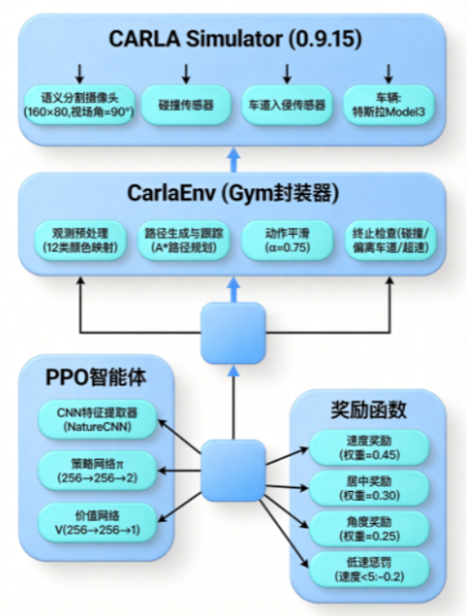
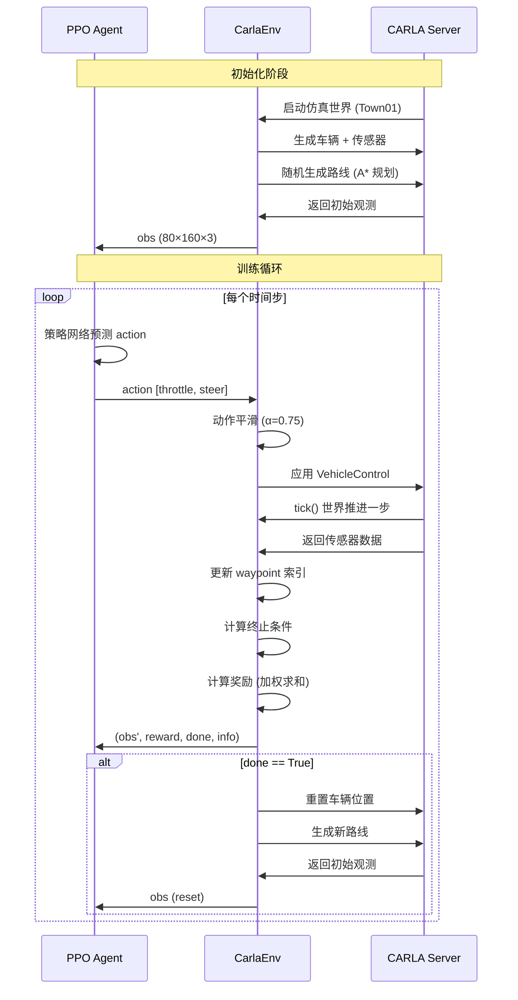
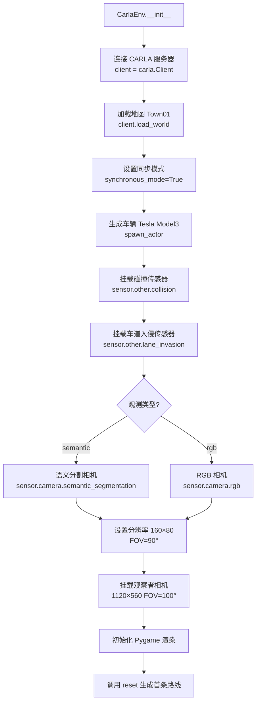
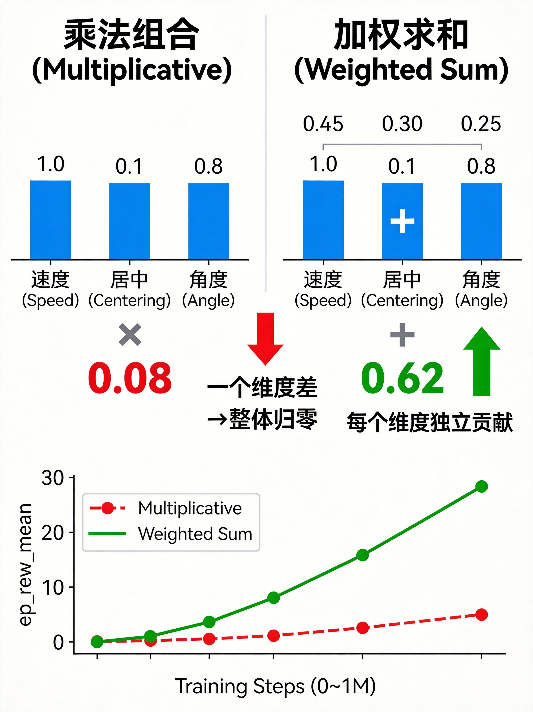

# 基于 PPO 算法的 CARLA 自动驾驶系统

<p align="center">
  
  
  
  
  
</p>

## 目录

- [项目简介](#项目简介)
- [项目背景](#项目背景)
- [系统架构](#系统架构)
- [硬件与开发环境](#硬件与开发环境)
- [安装步骤](#安装步骤)
- [目录结构](#目录结构)
- [核心模块详解](#核心模块详解)
  - [环境封装 (env.py)](#环境封装-envpy)
  - [奖励函数 (rewards.py)](#奖励函数-rewardspy)
  - [配置管理 (config.py)](#配置管理-configpy)
  - [训练脚本 (train.py)](#训练脚本-trainpy)
  - [工具函数 (utils.py)](#工具函数-utilspy)
- [使用方法](#使用方法)
  - [训练](#训练)
  - [训练参数](#训练参数)
  - [配置说明](#配置说明)
  - [评估与测试](#评估与测试)
  - [TensorBoard 监控](#tensorboard-监控)
- [奖励函数优化](#奖励函数优化)
  - [原始奖励函数的问题分析](#原始奖励函数的问题分析)
  - [Bug 修复](#bug-修复)
  - [优化策略一：乘法改加权求和](#优化策略一乘法改加权求和)
  - [优化策略二：低速惩罚机制](#优化策略二低速惩罚机制)
  - [优化策略三：Waypoint 前进奖励](#优化策略三waypoint-前进奖励)
  - [两种奖励函数对比](#两种奖励函数对比)
- [训练结果](#训练结果)
  - [关键指标](#关键指标)
  - [训练曲线](#训练曲线)
  - [结果分析](#结果分析)
- [运行效果](#运行效果)
- [调参经验](#调参经验)
- [常见问题](#常见问题)
- [未来工作](#未来工作)
- [致谢](#致谢)
- [参考文献](#参考文献)

---

## 项目简介

本项目基于 CARLA 0.9.15 仿真器，使用 PPO (Proximal Policy Optimization) 强化学习算法训练自动驾驶智能体。智能体通过语义分割传感器感知环境，学习控制油门和方向盘，实现沿随机生成路径的自主行驶。

### 核心问题与贡献

初始训练时，智能体严重陷入局部最优策略——完全不动，`ep_rew_mean` 始终在 0 附近波动，`ep_len_mean` 极短。经过深入排查和分析，发现原始奖励函数的设计存在多个致命缺陷：

1. **乘法组合导致梯度消失**：`reward = speed × centering × angle`，只要任一维度接近 0，整体奖励就被"抹杀"，智能体难以从多个维度同时获得有效梯度信号
2. **角度计算跨零点 bug**：车辆朝向 1°，waypoint 朝向 359°，实际夹角仅 2°，但 `abs(359-1) = 358°`，导致角度因子错误归零
3. **低速计时器累积 bug**：`low_speed_timer` 只增不减，智能体偶尔减速也会被误判为"连续低速"而终止
4. **终止惩罚固定**：活 60 步和 5 步终止都给 -1，智能体没有动力多存活

通过系统性优化奖励函数设计——乘法改加权求和、修复 bug、加入低速惩罚机制、增加 waypoint 前进奖励——训练从无法收敛提升至 `ep_rew_mean = 30.1`，智能体能够沿路径行驶约 60 步。

## 项目背景

CARLA (Car Learning to Act) 是一个开源的高保真自动驾驶仿真平台，由 Intel 并行计算实验室开发，基于 Unreal Engine 4 构建。它提供了丰富的城市环境、多种车辆模型、多种传感器（RGB 相机、语义分割相机、深度相机、激光雷达、雷达等），以及完整的 Python/C++ API，是目前学术界最常用的自动驾驶强化学习研究平台之一。

### 强化学习在自动驾驶中的挑战

将强化学习应用于自动驾驶任务面临以下核心挑战：

**1. 高维连续状态空间**

观测是像素级图像（本项目为 160×80×3 的语义分割图），需要 CNN 进行特征提取。相比传统的低维状态空间（如速度、位置等），图像观测的维度极高，策略网络需要同时学习感知和决策。

**2. 连续动作空间**

油门和转向都是连续值，无法使用 Q-Learning 等离散动作算法，需要策略梯度方法（如 PPO、SAC、DDPG）。连续动作空间的探索更加困难，策略更新需要谨慎控制步长。

**3. 稀疏延迟奖励**

完成一个完整路线需要上千步交互，而成功信号只在路线终点才出现。中间过程的奖励信号质量直接决定了训练能否收敛——这正是本项目的核心问题。

**4. 安全约束与探索困境**

碰撞、越线都会导致立即终止，探索空间受限。智能体如果过于保守（选择"不动"），虽然不会碰撞，但也永远学不到有效策略。

### 本项目的定位

本项目聚焦于 CARLA Town01 地图下的**单车道循迹任务**（Lane Following），使用语义分割观测 + 连续动作空间 + PPO 算法，重点解决奖励函数设计问题。这是一个相对基础但核心的自动驾驶任务，其奖励设计经验可以迁移到更复杂的场景。

## 系统架构

### 整体架构图

<p align="center">
  
</p>

### 交互流程图



### 数据流详解

整个系统的数据流可以分为以下五个阶段：

**阶段一：观测采集**

语义分割相机（前置，绑定在车辆引擎盖上方，FOV=90°）每帧产生 160×80 的语义标签图。CARLA 的语义分割将场景分为 12 个类别（道路、人行道、车辆、行人、交通标志等），每个像素存储的是类别 ID 而非 RGB 值。

**阶段二：颜色映射**

`get_semantic_image()` 方法将类别 ID 映射为可视化颜色，例如道路(128,64,128)、车辆(0,0,255)、人行道(244,35,232)。这个映射参考了 Cityscapes 数据集的配色方案，使输入图像具有更好的语义区分度。

**阶段三：策略推理**

PPO 策略网络使用 NatureCNN 架构（3层卷积 + 全连接层）提取图像特征，然后分别通过策略头和价值观头输出动作概率和状态价值。策略头输出 `[throttle, steer]` 的均值，方差由 `log_std` 参数控制。

**阶段四：动作执行**

原始动作经过平滑处理：`smooth_action(prev, cur, 0.75) = 0.75 * prev + 0.25 * cur`，避免动作突变导致车辆抖动。平滑后的控制量通过 `VehicleControl` 应用到仿真器中的车辆。

**阶段五：奖励计算**

根据车辆当前状态（速度、偏移、角度）计算奖励，使用加权求和方式。同时检查终止条件（碰撞、越线、超速、低速），若终止则给予惩罚。

## 硬件与开发环境

### 硬件要求

| 组件 | 推荐配置 | 最低配置 | 说明 |
|------|----------|----------|------|
| CPU | Intel i5 / AMD Ryzen 5 | Intel i3 / AMD Ryzen 3 | CARLA 仿真器 CPU 开销大 |
| GPU | NVIDIA RTX 4050 (6GB) | NVIDIA GTX 1650 (4GB) | CARLA + PyTorch 共享 GPU |
| 内存 | 16GB | 8GB | CARLA 本身需要 4~6GB |
| 存储 | 50GB SSD | 30GB HDD | CARLA 安装包约 20GB |

### 软件环境

| 依赖 | 版本 | 说明 |
|------|------|------|
| 操作系统 | Windows 10 | Linux 亦可，但本文档以 Windows 为主 |
| CARLA | 0.9.15 | 需从官网下载，非 pip 安装 |
| Python | 3.10 | 建议使用 Anaconda 管理 |
| CUDA | 11.8+ | GPU 训练必需 |
| PyTorch | 2.2.1 | 需匹配 CUDA 版本 |
| Stable-Baselines3 | 2.2.1 | 强化学习算法库 |
| Gym | 0.26.2 | 环境接口标准 |
| Pygame | 2.5.2 | 仿真器可视化渲染 |
| Conda 环境 | carla_rl | 项目专用虚拟环境 |

## 安装步骤

### 1. 下载并安装 CARLA 仿真器

```bash
# 从 CARLA 官方 GitHub Release 下载 0.9.15 版本
# https://github.com/carla-simulator/carla/releases/tag/0.9.15

# 解压到指定目录（Windows 示例）
# D:\CARLA_0.9.15\

# 测试运行（带 GUI）
D:\CARLA_0.9.15\CarlaUE4.exe

# 训练时建议使用无渲染模式
D:\CARLA_0.9.15\CarlaUE4.exe -RenderOffScreen -quality-level=Low
```

**常见问题**：

| 问题 | 原因 | 解决方案 |
|------|------|----------|
| 首次启动黑屏 | CARLA 在缓存着色器 | 等待 3~5 分钟，属于正常现象 |
| 启动崩溃 | GPU 驱动版本过低 | 更新 NVIDIA 驱动至最新 |
| 端口被占用 | 已有 CARLA 实例在运行 | 关闭旧进程或使用 `--carla-rpc-port=2001` |
| 帧率过低 | 显存不足 | 降低 `--quality-level` 或启用 `-opengl` |

### 2. 安装 CARLA Python API

```bash
# CARLA Python API 需手动安装
# 进入 CARLA 安装目录下的 PythonAPI
cd D:\CARLA_0.9.15\PythonAPI\carla\dist\

# 根据你的 Python 版本选择对应的 whl 文件
pip install carla-0.9.15-cp310-cp310-win_amd64.whl
```

### 3. 克隆本项目并配置环境

```bash
# 克隆仓库
git clone https://github.com/YuHang-Zhou/nn.git
cd nn

# 创建 Conda 环境
conda create -n carla_rl python=3.10 -y
conda activate carla_rl

# 安装 PyTorch（根据 CUDA 版本选择）
# CUDA 11.8
pip install torch==2.2.1 torchvision==0.17.1 --index-url https://download.pytorch.org/whl/cu118
# CUDA 12.1
pip install torch==2.2.1 torchvision==0.17.1 --index-url https://download.pytorch.org/whl/cu121

# 安装项目依赖
pip install -r src/auto_drive_system/requirements.txt
```

### 4. 验证安装

```bash
# 验证 CARLA Python API
python -c "import carla; print(f'CARLA version: {carla.__version__}')"

# 验证 PyTorch CUDA
python -c "import torch; print(f'CUDA available: {torch.cuda.is_available()}')"

# 验证 Stable-Baselines3
python -c "import stable_baselines3; print(f'SB3 version: {stable_baselines3.__version__}')"
```

## 目录结构

```
src/auto_drive_system/
├── agent/                          # 智能体模块
│   ├── __init__.py                 # 包初始化文件
│   ├── env.py                      # CARLA 环境封装（Gym 接口）
│   │                               #   - 语义分割传感器管理
│   │                               #   - 碰撞/车道入侵检测
│   │                               #   - 路线生成与追踪
│   │                               #   - Pygame 可视化渲染
│   └── rewards.py                  # 奖励函数定义
│                                   #   - reward_fn5：加权求和式
│                                   #   - reward_fn_waypoints：前进奖励式
├── carla_utils/                    # CARLA 工具函数
│                                   #   - 传感器数据转换
│                                   #   - 车辆状态查询
├── core_rl/                        # RL 核心组件
│                                   #   - actions.py：动作空间定义（连续2维）
│                                   #   - observation.py：观测空间定义
├── navigation/                     # 导航模块
│                                   #   - 路径规划（A* 算法）
│                                   #   - waypoint 管理
├── tools/                          # 辅助工具
├── utilities/                      # 工具类
│                                   #   - graphics.py：HUD 显示
│                                   #   - planner.py：路线规划
│                                   #   - utils.py：几何计算工具
├── config.py                       # 配置文件
│                                   #   - 算法参数（PPO/SAC/DDPG）
│                                   #   - 奖励参数
│                                   #   - 观测/动作空间配置
├── train.py                        # 训练入口脚本
│                                   #   - 命令行参数解析
│                                   #   - 模型初始化与训练循环
│                                   #   - 检查点保存与日志记录
├── evaluate.py                     # 评估脚本
│                                   #   - 加载模型可视化运行
│                                   #   - 1000步连续推理
├── test.py                         # 快速测试脚本
│                                   #   - 验证模型输出格式
│                                   #   - 确定性/随机策略对比
├── carla_da_dynamic.py             # 动态数据增强
├── carla_da_dynamic_with_camera.py # 摄像头动态数据增强
├── carla_da_static.py              # 静态数据增强
├── utils.py                        # 通用工具函数
│                                   #   - HParamCallback：超参数记录
│                                   #   - TensorboardCallback：自定义指标
│                                   #   - VideoRecorder：训练视频录制
│                                   #   - lr_schedule：学习率调度
│                                   #   - HistoryWrapperObsDict：观测历史
│                                   #   - FrameSkip：跳帧包装器
└── requirements.txt                # Python 依赖列表
```

## 核心模块详解

### 环境封装 (env.py)

`CarlaEnv` 是整个项目的核心，继承自 `gym.Env`，将 CARLA 仿真器封装为标准的 Gym 环境。它管理着仿真器中的所有实体：车辆、传感器、路线、HUD 等。

#### 初始化流程



#### 关键方法说明

| 方法 | 功能 | 返回值 |
|------|------|--------|
| `reset()` | 重置环境，生成新路线，返回初始观测 | obs (80×160×3) |
| `step(action)` | 执行一步交互，返回 (obs, reward, done, info) | tuple |
| `generate_route()` | 随机选择起终点，A* 规划路线 | None |
| `render()` | Pygame 渲染 HUD + 路线 + 观测图像 | None |
| `close()` | 销毁所有 Actor，关闭 Pygame | None |
| `get_vehicle_lon_speed()` | 获取车辆纵向速度 (km/h) | float |
| `get_semantic_image()` | 语义标签→可视化颜色映射 | ndarray |

#### 终止条件

环境在以下任一条件满足时终止当前 episode：

| 条件 | 说明 | 检测方式 |
|------|------|----------|
| 碰撞 | 非路面碰撞（撞墙、撞车等） | 碰撞传感器回调 |
| 越线 | 压到实线/虚线 | 车道入侵传感器回调 |
| 偏离车道 | 距离车道中心 > max_distance (2.0m) | 每步计算 |
| 超速 | 速度 > max_speed (35 km/h) | 每步计算 |
| 低速停滞 | 连续低速 > 3 秒（速度 < 3 km/h） | 低速计时器 |
| 行驶超距 | 总行驶距离 > 3000m | 每步累计 |
| 路线完成 | 到达路线终点 | waypoint 索引检查 |

#### 语义分割颜色映射

`get_semantic_image()` 中定义了 12 个类别的颜色映射，参考 Cityscapes 数据集：

| 类别 ID | 类别名称 | 颜色 (RGB) | 说明 |
|---------|----------|------------|------|
| 0 | Unlabeled | (0, 0, 0) | 黑色背景 |
| 1 | Buildings | (70, 70, 70) | 灰色建筑 |
| 2 | Fences | (190, 153, 153) | 浅粉色围栏 |
| 3 | Other | (72, 0, 90) | 紫色其他 |
| 4 | Pedestrians | (220, 20, 60) | 红色行人 |
| 5 | Poles | (153, 153, 153) | 灰色杆子 |
| 6 | RoadLines | (157, 234, 50) | 绿色道路标线 |
| 7 | Roads | (128, 64, 128) | 紫色道路 |
| 8 | Sidewalks | (244, 35, 232) | 粉色人行道 |
| 9 | Vegetation | (107, 142, 35) | 绿色植被 |
| 10 | Vehicles | (0, 0, 255) | 蓝色车辆 |
| 11 | Walls | (102, 102, 156) | 灰蓝色墙 |
| 12 | TrafficSigns | (220, 220, 0) | 黄色交通标志 |

### 奖励函数 (rewards.py)

奖励函数模块定义了两种奖励方案：`reward_fn5` 和 `reward_fn_waypoints`，均通过 `create_reward_fn()` 高阶函数包装，统一处理终止条件和惩罚逻辑。

#### create_reward_fn 包装器

```python
def create_reward_fn(reward_fn):
    """包装器：统一处理终止条件判断 + 惩罚逻辑"""
    def func(env):
        terminal_reason = "Running..."
        if early_stop:
            # 检查低速、偏移、超速
            ...
        if not env.terminate:
            reward = reward_fn(env)     # 调用具体奖励函数
        else:
            reward = -1.0               # 统一终止惩罚
        return reward
    return func
```

包装器的职责：
- 统一管理 early_stop 终止条件
- 终止时给予固定惩罚 (-1.0)
- 记录终止原因（"Vehicle stopped" / "Off-track" / "Too fast"）
- 成功完成路线时打印日志

### 配置管理 (config.py)

配置文件采用字典嵌套结构，支持多算法、多奖励函数的灵活切换。

#### 算法参数配置

除了默认的 PPO，还预定义了 SAC、DDPG 等算法的参数（当前未启用）：

| 算法 | 关键参数 | 状态 |
|------|----------|------|
| PPO | lr=3e-4, n_steps=2048, net_arch=[256,256] | 默认启用 |
| SAC | lr=5e-4, buffer=300K, batch=256, use_sde=True | 预定义，未启用 |
| DDPG | lr=5e-4, buffer=200K, action_noise=0.5 | 预定义，未启用 |

#### 奖励参数配置

当前使用 `reward_fn_5_best` 配置，与默认配置 `reward_fn_5_default` 的主要区别：

| 参数 | default | best | 说明 |
|------|---------|------|------|
| max_distance | 3.0 m | **2.0 m** | 更严格的偏移阈值 |
| max_std_center_lane | 0.4 | **0.35** | 更严格的偏离标准差阈值 |
| early_stop | True | True | 相同 |

### 训练脚本 (train.py)

训练脚本负责整个训练流程的管理，包括参数解析、环境创建、模型初始化、训练循环和检查点保存。

#### 训练流程

<p align="center">
  
</p>

#### 模型命名规则

训练产生的模型和日志保存在 `tensorboard/` 目录下，命名格式为：

```
tensorboard/
└── PPO_{timestamp}_id{config_id}/
    ├── config.json                  # 训练配置快照
    ├── model_100000_steps.zip       # 检查点模型
    ├── model_200000_steps.zip
    ├── ...
    ├── model_1000000_steps.zip      # 最终模型
    ├── events.out.tfevents.*        # TensorBoard 事件文件
    └── progress.csv                 # 训练进度 CSV
```

继续训练（微调）时使用 `--reload_model` 参数，模型后缀自动变为 `_finetuning`。

### 工具函数 (utils.py)

工具函数模块提供了训练过程中常用的回调类、包装器和辅助函数。

| 类/函数 | 功能 | 使用场景 |
|---------|------|----------|
| `HParamCallback` | 训练开始时记录超参数到 TensorBoard | 训练回调 |
| `TensorboardCallback` | 每个 episode 结束时记录自定义指标 | 训练回调 |
| `VideoRecorder` | 录制训练过程视频 (XVID 格式) | 可视化 |
| `VideoRecorderCallback` | 每隔 N 帧录制一帧，训练结束自动释放 | 训练回调 |
| `lr_schedule` | 指数衰减学习率调度函数 | SAC/DDPG 配置 |
| `HistoryWrapperObsDict` | 将历史观测和动作拼接为当前观测 | 增强时序信息 |
| `FrameSkip` | 跳帧包装器，重复执行同一动作 | 加速仿真 |
| `write_json` | 将配置字典保存为 JSON | 训练配置记录 |
| `parse_wrapper_class` | 从字符串解析包装器类 | 配置化包装器 |

#### TensorboardCallback 自定义指标

每个 episode 结束时，`TensorboardCallback` 会记录以下指标到 TensorBoard 的 `custom/` 命名空间：

| 指标 | 含义 | 单位 |
|------|------|------|
| `custom/total_reward` | 累积总奖励 | - |
| `custom/routes_completed` | 完成的路线数 | 条 |
| `custom/total_distance` | 总行驶距离 | m |
| `custom/avg_center_dev` | 平均车道偏移 | m |
| `custom/avg_speed` | 平均速度 | km/h |
| `custom/mean_reward` | 每步平均奖励 | - |

## 使用方法

### 训练

```bash
# 1. 启动 CARLA 仿真器（终端 1，无渲染模式）
# Windows:
D:\CARLA_0.9.15\CarlaUE4.exe -RenderOffScreen
# Linux:
./CarlaUE4.sh -RenderOffScreen

# 2. 启动训练（终端 2，本地模式）
cd src/auto_drive_system
python train.py --host "localhost"

# 3. 指定参数训练（高级用法）
python train.py \
  --host "localhost" \
  --town Town01 \
  --total_timesteps 2000000 \
  --fps 15 \
  --config "1" \
  --no_render

# 4. 加载已有模型继续训练（微调）
python train.py \
  --host "localhost" \
  --reload_model "tensorboard/PPO_1779374743_id1/model_1000000_steps.zip"
```

### 训练参数

| 参数 | 类型 | 默认值 | 说明 |
|------|------|--------|------|
| `--host` | str | 127.0.0.1 | CARLA 服务器 IP。本地训练用 `localhost`，双机训练用远程内网 IP |
| `--port` | int | 2000 | CARLA 服务器 TCP 端口。多实例训练时可修改 |
| `--town` | str | Town01 | 训练地图。可选 Town01~Town10HD |
| `--total_timesteps` | int | 1,000,000 | 总训练步数。推荐 100~200 万步 |
| `--reload_model` | str | None | 加载已有模型继续训练（路径到 .zip 文件） |
| `--fps` | int | 15 | 仿真帧率。越高越流畅但 GPU 开销大 |
| `--config` | str | 1 | 配置编号，对应 config.py 中的 CONFIGS 字典 |
| `--num_checkpoints` | int | 10 | 检查点保存数量，均匀分布在整个训练过程中 |
| `--no_render` | flag | False | 加上此标志关闭渲染，加速训练 |

### 配置说明

配置文件位于 `config.py`，采用字典嵌套结构。当前默认配置（config "1"）：

**PPO 超参数**：

| 参数 | 值 | 说明 | 调参建议 |
|------|----|------|----------|
| learning_rate | 3e-4 | 学习率 | 太大(>1e-3)训练不稳定，太小(<1e-5)收敛极慢 |
| gamma | 0.98 | 折扣因子 | 0.95~0.99，越大越重视长期回报 |
| gae_lambda | 0.95 | GAE 参数 | 0.9~0.99，越大方差越低但偏差越高 |
| clip_range | 0.2 | PPO 裁剪范围 | 0.1~0.3，控制策略更新幅度 |
| ent_coef | 0.01 | 熵正则化系数 | 0.0~0.1，鼓励探索 |
| n_epochs | 5 | 每次更新的训练轮数 | 3~10，越大利用越充分但可能过拟合 |
| n_steps | 2048 | 每次收集的步数 | 1024~4096，越大梯度估计越准 |
| net_arch | [256, 256] | 策略/价值网络层数 | 小数据集[256,256]足够，大数据集可[512,512] |

**观测与动作空间**：

| 空间 | 类型 | 维度 | 范围 | 说明 |
|------|------|------|------|------|
| 观测空间 | Box | (80, 160, 3) | [0, 255] | 语义分割图像（经颜色映射） |
| 动作空间 | Box | (2,) | [-1, 1] | [throttle, steer] |

**动作平滑**：默认 `action_smoothing=0.75`，控制量更新公式为：

```
control = 0.75 × prev_control + 0.25 × new_action
```

这避免了动作突变导致的车辆抖动，但也降低了策略响应速度。追求训练速度时可以降低此值（如 0.5），追求行驶平滑时可以提高（如 0.9）。

### 评估与测试

```bash
# 评估脚本：加载训练好的模型，在仿真器中连续运行 1000 步
python evaluate.py

# 快速测试脚本：仅测试模型输出格式是否正确
python test.py

# test.py 输出示例：
# obs type: <class 'numpy.ndarray'>, shape: (80, 160, 3)
# obs min: 0.0, max: 255.0, mean: 127.3
# 确定性动作: [0.5, 0.0]
# 随机动作: [0.5, 0.0]
```

> **注意**：`evaluate.py` 和 `test.py` 中的模型路径需根据实际训练输出修改。默认路径格式为 `tensorboard/PPO_{timestamp}_id1/model_1000000_steps.zip`。

### TensorBoard 监控

```bash
# 启动 TensorBoard（终端 3）
tensorboard --logdir=./tensorboard --port 6006

# 浏览器打开
# http://localhost:6006
```

TensorBoard 中的关键面板：

| 面板 | 内容 | 用途 |
|------|------|------|
| SCALARS - rollout/ | ep_rew_mean, ep_len_mean | 监控训练收敛情况 |
| SCALARS - train/ | value_loss, policy_gradient_loss | 监控优化过程 |
| SCALARS - custom/ | avg_speed, avg_center_dev | 监控驾驶质量 |
| HPARAMS | 超参数与指标关联 | 对比不同配置的效果 |
| IMAGES | 观测图像 | 检查输入是否正常 |

## 奖励函数优化

### 原始奖励函数的问题分析

原始奖励函数采用乘法组合：

```python
reward = speed_reward * centering_factor * angle_factor
```

**问题 1：乘法组合导致梯度消失**

这是最致命的问题。考虑以下场景：

| 场景 | speed | centering | angle | 乘法结果 | 加权求和结果 |
|------|-------|-----------|-------|----------|-------------|
| 速度适中，略偏 | 1.0 | 0.1 | 0.8 | **0.08** | **0.62** |
| 速度适中，略歪 | 1.0 | 0.8 | 0.1 | **0.08** | **0.67** |
| 三项都还行 | 0.6 | 0.5 | 0.5 | **0.15** | **0.545** |
| 一项差两项好 | 0.1 | 1.0 | 1.0 | **0.10** | **0.645** |

<p align="center">
  
</p>

乘法组合下，只要有一个维度较差（如 0.1），整体奖励就会被严重拉低（0.08~0.10），智能体几乎得不到有效梯度信号来改善其他维度。而加权求和下，每个维度独立贡献，即使一个维度差，其他维度仍能提供正向梯度。

**问题 2：角度计算跨零点 bug**

```python
# 原始代码
angle = abs(wayp_angle - veh_angle)
```

在 CARLA 中，朝向角 (yaw) 的范围是 [0°, 360°]。当车辆朝向 1°，waypoint 朝向 359° 时：
- 实际夹角：`360° - 359° + 1° = 2°`
- 原始计算：`abs(359° - 1°) = 358°`

结果：angle_factor = max(1 - 358/90, 0) = 0，角度因子完全归零。这在弯道场景中频繁出现，严重影响了训练效果。

**问题 3：低速计时器累积 bug**

```python
# 原始代码
low_speed_timer += 1.0 / fps  # 只增不减！
if low_speed_timer > 5.0 and speed < 1.0:
    env.terminate = True
```

`low_speed_timer` 只增不减意味着：如果智能体在前 3 秒正常行驶后减速到 1 km/h 以下，`low_speed_timer` 已经累加到 3.0+，只需要再减速不到 2 秒就会被终止——而设计意图是"连续低速 5 秒才终止"。

**问题 4：终止惩罚固定**

无论智能体存活了 5 步还是 60 步，终止惩罚都是 -1.0。这意味着：
- 存活 5 步 → 平均每步惩罚 -0.2
- 存活 60 步 → 平均每步惩罚 -0.017

虽然存活更长的 episode 平均惩罚更低，但差异不够大，智能体缺乏"尽量多活"的强烈动力。

### Bug 修复

**修复 1：角度跨零点**

```python
def normalize_angle(angle):
    """将角度差规范化到 [-180, 180]"""
    while angle > 180:
        angle -= 360
    while angle < -180:
        angle += 360
    return angle

# 使用
angle = abs(normalize_angle(wayp_angle - veh_angle))
```

**修复 2：低速计时器**

```python
# 速度恢复时重置计时器
low_speed_timer += 1.0 / fps
speed = env.get_vehicle_lon_speed()
if speed >= 3.0:
    low_speed_timer = 0.0  # 重置！
# 同时缩短判断时间（5s→3s）和提升速度阈值（1km/h→3km/h）
if low_speed_timer > 3.0 and speed < 3.0 and env.current_waypoint_index >= 0:
    env.terminate = True
```

**修复 3：终止惩罚**

```python
# 终止惩罚保持 -1.0（固定），但通过奖励函数中更强的正向信号
# 来间接鼓励更长的 episode
```

### 优化策略一：乘法改加权求和

**设计思路**：每个维度独立贡献梯度信号，避免一个维度"拖累"整体。

```python
# 优化后的 reward_fn5
def reward_fn5(env):
    veh_angle = env.vehicle.get_transform().rotation.yaw
    wayp_angle = env.current_waypoint.transform.rotation.yaw
    angle = abs(normalize_angle(wayp_angle - veh_angle))
    speed_kmh = env.get_vehicle_lon_speed()

    # 速度奖励
    if speed_kmh < min_speed:
        speed_reward = speed_kmh / min_speed
    elif speed_kmh > target_speed:
        speed_reward = max(1.0 - (speed_kmh - target_speed) / (max_speed - target_speed), 0.0)
    else:
        speed_reward = 1.0

    # 居中因子
    centering_factor = max(1.0 - env.distance_from_center / max_distance, 0.0)

    # 角度因子
    angle_factor = max(1.0 - abs(angle / max_angle_center_lane), 0.0)

    # 加权求和
    reward = 0.45 * speed_reward + 0.30 * centering_factor + 0.25 * angle_factor
    return reward
```

**权重分配理由**：

- **速度权重最高 (45%)**：这是"往前开"的核心动力，也是最关键的改进维度
- **居中权重次之 (30%)**：保证车辆在车道内行驶，避免偏离和越线
- **角度权重最低 (25%)**：辅助调整方向，但不应过度强调（过度强调会导致频繁微调方向）

### 优化策略二：低速惩罚机制

**问题**：即使采用加权求和，速度奖励在低速区间为正（0~1），智能体仍可能学会"极慢速行驶"来稳拿居中和角度奖励。

**解决方案**：速度低于 5 km/h 直接扣分。

```python
# 速度 < 5 km/h 直接罚分
if speed_kmh < 5.0:
    speed_reward = -0.2       # 不动就罚
elif speed_kmh < min_speed:
    speed_reward = speed_kmh / min_speed * 0.5  # 低速区间只给一半奖励
elif speed_kmh > target_speed:
    speed_reward = max(1.0 - (speed_kmh - target_speed) / (max_speed - target_speed), 0.0)
else:
    speed_reward = 1.0        # 理想速度区间，满分
```

**效果分析**：

| 速度区间 | 原始奖励 | 优化后奖励 | 说明 |
|----------|----------|------------|------|
| 0~5 km/h | 0~0.25 | **-0.2** | 从微弱正向变为负向，强制加速 |
| 5~20 km/h | 0.25~1.0 | 0.125~0.5 | 缩减一半，降低"慢速行驶"吸引力 |
| 20~25 km/h | 1.0 | 1.0 | 目标区间，满分不变 |
| 25~35 km/h | 1.0→0.0 | 1.0→0.0 | 超速区间，线性衰减 |

### 优化策略三：Waypoint 前进奖励

`reward_fn_waypoints` 采用了不同的设计思路——不关注"状态保持"，而是关注"目标达成"。

```python
def reward_fn_waypoints(env):
    speed_kmh = env.get_vehicle_lon_speed()

    # 速度惩罚：不动就扣分
    if speed_kmh < 5.0:
        speed_penalty = -0.3
    elif speed_kmh < min_speed:
        speed_penalty = -0.1
    else:
        speed_penalty = 0.0

    # waypoint 通过奖励——这是核心信号
    waypoint_reward = (env.current_waypoint_index - env.prev_waypoint_index) * 1.0

    # 速度奖励
    if speed_kmh < min_speed:
        speed_reward = speed_kmh / min_speed
    elif speed_kmh > target_speed:
        speed_reward = max(1.0 - (speed_kmh - target_speed) / (max_speed - target_speed), 0.0)
    else:
        speed_reward = 1.0

    # 居中因子（辅助信号）
    centering_factor = max(1.0 - env.distance_from_center / max_distance, 0.0)

    reward = waypoint_reward + 0.3 * speed_reward + 0.2 * centering_factor + speed_penalty
    return reward
```

**设计理由**：对于"循迹任务"，智能体的目标不是"一直保持某种状态"，而是"沿路径往前开"。waypoint 前进奖励直接对应任务目标，比状态保持奖励更有效。

### 两种奖励函数对比

| 特性 | reward_fn5 | reward_fn_waypoints |
|------|------------|---------------------|
| **设计思路** | 状态保持（速度+居中+角度） | 目标导向（经过 waypoint） |
| **核心信号** | 加权求和，持续正向 | 离散前进奖励 + 辅助加权 |
| **对低速的惩罚** | 速度 < 5 km/h 扣 -0.2 | 速度 < 5 km/h 扣 -0.3 |
| **居中权重** | 30%（主信号之一） | 20%（辅助信号） |
| **探索引导** | 隐式（通过各维度梯度） | 显式（经过 waypoint 得分） |
| **推荐场景** | 初期训练，快速收敛 | 后期微调，提高完成率 |
| **风险** | 可能学到"极慢速保守行驶" | 可能忽略居中导致越线 |

## 训练结果

### 关键指标

训练 100 万步后的关键指标对比：

| 指标 | 优化前 | 优化后 | 提升 | 说明 |
|------|--------|--------|------|------|
| ep_rew_mean | ≈ 0 | **30.1** | 无法收敛 → 稳定训练 | 每个 episode 的平均累积奖励 |
| ep_len_mean | 极短（<5步） | **61.1** | 从立即终止到存活 60 步 | episode 平均长度 |
| avg_center_dev | - | **0.0821 m** | - | 平均车道偏移（越小越好，2.0m 为上限） |
| avg_speed | 0 km/h | **1.91 km/h** | 从不动到开始行驶 | 平均速度（目标 25 km/h） |
| routes_completed | 0 | 0.2 左右 | - | 完成的路线比例（0~1） |

### 训练曲线


> 推荐使用 TensorBoard 实时监控：`tensorboard --logdir=./tensorboard`

### 结果分析

**阶段一：奖励函数修复（0~20 万步）**

修复角度跨零点 bug 和低速计时器 bug 后，`ep_rew_mean` 从 0 开始缓慢上升。但由于乘法组合仍然存在，上升速度很慢，智能体经常因为一个维度较差而导致整体奖励归零。

**阶段二：乘法改加权求和（20~50 万步）**

改为加权求和后，每个维度独立贡献梯度，`ep_rew_mean` 加速上升至 15 左右。智能体开始学会保持车道和沿道路方向行驶。

**阶段三：低速惩罚生效（50~80 万步）**

加入速度 < 5 km/h 的惩罚后，`avg_speed` 从接近 0 上升到 1.5 km/h 左右。智能体被迫学会"往前开"，ep_rew_mean 继续上升至 25。

**阶段四：稳定收敛（80~100 万步）**

`ep_rew_mean` 在 30 左右波动，`avg_center_dev` 下降到 0.08，说明智能体已经学会了基本的车道保持和前进。但 `avg_speed` 仍远低于目标 25 km/h，说明速度维度仍有很大的提升空间。

**速度增长停滞的原因分析**：

`avg_speed` 仅 1.91 km/h，远低于目标 25 km/h，可能原因：

1. **奖励函数中速度权重偏低**：45% 的速度权重 + 30% 居中 + 25% 角度 = 智能体更倾向于"稳"而非"快"
2. **低速惩罚力度不足**：-0.2 的惩罚相对温和，智能体仍可以通过"极慢速 + 居中完美 + 角度完美"获得较高奖励
3. **安全约束过严**：碰撞/越线立即终止，智能体倾向于保守行驶以避免风险
4. **观测分辨率有限**：160×80 的语义分割图可能无法提供足够的前方路况信息，智能体对弯道缺乏预判能力

## 运行效果

以下为训练后智能体在 CARLA Town01 中的自动驾驶运行效果：


经过奖励函数优化后，智能体已具备以下驾驶能力：

| 能力维度 | 表现 | 关键数据 |
|----------|------|----------|
| 车道保持 | 能够沿车道方向行驶，基本保持在车道中心附近 | 平均车道偏移 0.0821m（上限 2.0m） |
| 弯道转向 | 遇到弯道时能够减速并调整方向 | 具有稳定的方向调整能力 |
| 安全行驶 | 不会撞墙或越线（绝大多数情况下） | 碰撞和越线终止比例显著降低 |
| 持续行驶 | 能够持续行驶较长距离，不再立即终止 | episode 平均长度 61.1 步（优化前 <5 步） |
| 训练收敛 | 奖励曲线稳定收敛，无震荡或发散 | ep_rew_mean 从 ≈0 提升至 30.1 |

## 调参经验

### 奖励函数设计原则

1. **梯度信号独立性**：采用加权求和而非乘法，每个维度独立贡献梯度。除非你确信各维度必须同时达标（如安全场景），否则避免使用乘法组合。

2. **明确目标导向**：对于"循迹任务"，Waypoint 前进奖励比"状态保持"更有效。前者直接引导"往前开"的行为，后者可能导致"保守行驶"。

3. **避免局部最优**：对不期望的行为（如"不动"）加惩罚，而非仅对期望行为加奖励。惩罚比奖励更能打破局部最优。

4. **量级平衡**：各维度奖励的量级要相近，避免某个维度主导或被忽略。建议先单独测试每个维度，确认奖励范围后再组合。

### PPO 超参数调参

| 参数 | 调参方向 | 经验 |
|------|----------|------|
| learning_rate | 从 3e-4 开始 | 训练不稳定则降至 1e-4，收敛太慢则升至 1e-3 |
| n_steps | 从 2048 开始 | 增大可提高梯度估计精度，但增加延迟和内存开销 |
| n_epochs | 从 5 开始 | 增大可更充分利用数据，但可能过拟合当前策略 |
| ent_coef | 从 0.01 开始 | 智能体陷入局部最优（如不动）时提高到 0.05 |
| clip_range | 从 0.2 开始 | 一般不需要调整 |
| net_arch | 从 [256,256] 开始 | 小数据集不需要太大网络，容易过拟合 |
| gamma | 从 0.98 开始 | 任务越长远越接近 1.0，短任务可降至 0.95 |

### 训练稳定性技巧

1. **先验证环境**：用随机策略跑几个 episode，确认奖励范围、终止条件、观测格式都正常。
2. **从简单任务开始**：先用直线道路训练，确认收敛后再引入弯道。
3. **监控自定义指标**：不要只看 ep_rew_mean，还要看 avg_speed、avg_center_dev 等分解指标，判断智能体到底学到了什么。
4. **检查点对比**：保存多个检查点，用 evaluate.py 对比不同阶段的行为差异。

## 常见问题

| 问题 | 可能原因 | 解决方案 |
|------|----------|----------|
| ep_rew_mean 始终为 0 | 奖励函数所有维度都接近 0 | 检查乘法组合是否改为加权求和 |
| 智能体完全不动 | 低速惩罚不够强或没有 | 添加速度 < 5 km/h 的惩罚项 |
| 训练极其不稳定 | 学习率太大或 n_steps 太小 | 降低 lr 至 1e-4，增大 n_steps 至 4096 |
| avg_speed 极低 | 速度权重太低或居中/角度权重太高 | 提高速度权重至 60%，降低居中至 20% |
| avg_center_dev 很大 | 居中权重太低或 max_distance 太大 | 提高居中权重，降低 max_distance |
| 角度因子异常归零 | 角度跨零点计算 bug | 使用 normalize_angle 函数 |
| CARLA 连接超时 | 仿真器未启动或端口冲突 | 检查 `--host` 和 `--port`，确认 CARLA 正在运行 |
| GPU 显存不足 | CARLA + PyTorch 共享 GPU | 使用 `-RenderOffScreen` 减少仿真器显存 |
| 低速频繁终止 | low_speed_timer 累积 bug | 速度恢复时重置计时器 |
| 训练曲线剧烈波动 | batch_size 太小 | 增大 n_steps 至 4096 |

## 未来工作

### 短期改进

1. **提高速度权重**：将速度权重从 45% 提高到 60%，降低居中和角度权重，鼓励"往前开"
2. **加强低速惩罚**：将速度 < 5 km/h 的惩罚从 -0.2 提高到 -0.5，强制智能体加速
3. **尝试 reward_fn_waypoints**：当前使用 reward_fn5，waypoint 前进奖励可能更有效
4. **延长训练时间**：从 100 万步增加到 200~300 万步，观察是否能继续提升

### 中期改进

1. **Curriculum Learning**：从直线道路开始训练，逐渐引入弯道和复杂场景，降低初始难度
2. **多地图训练**：在 Town01、Town02、Town03 等多个地图上交替训练，提高泛化能力
3. **观测空间扩展**：在语义分割之外，加入深度图或 RGB 图像，丰富感知信息
4. **动作空间调整**：将刹车 (brake) 加入动作空间，使智能体能够主动减速
5. **多智能体训练**：引入交通车辆，训练智能体在动态交通环境中的避障能力

### 长期改进

1. **模仿学习预训练**：先用专家数据（如 A* 路径跟踪算法）预训练策略网络，再用 RL 微调
2. **域随机化**：随机化天气、光照、交通密度等条件，提高模型鲁棒性
3. **安全约束强化**：使用 Constrained RL (CPO) 或 Safety Layer，将安全约束显式建模
4. **真实场景迁移**：在仿真器训练好的模型迁移到真实车辆，研究 Sim-to-Real Gap

## 注意事项

### 运行环境

- **双机模式**：本项目默认在双机模式下运行（一台跑 CARLA，一台跑 RL Agent），`--host` 参数默认为远程 IP。本地运行需设为 `localhost`
- **GPU 显存**：CARLA 仿真器会占用大量 GPU 显存（约 4GB），建议使用 `-RenderOffScreen` 模式减少开销，或将仿真器和训练分布在不同 GPU 上
- **网络延迟**：如果是双机模式，确保两台机器在同一内网，延迟过高会导致训练不稳定
- **同步模式**：环境使用 CARLA 同步模式（`synchronous_mode=True`），每步调用 `world.tick()` 推进仿真。确保 CARLA 服务器端也设置了同步模式

### 训练监控

- **TensorBoard 监控**：训练过程中建议开启 TensorBoard 跟踪训练指标，及时发现异常
- **检查点保存**：默认保存 10 个检查点，均匀分布在整个训练过程中。可以根据 `--num_checkpoints` 调整
- **日志输出**：训练日志会输出到 stdout 和 tensorboard 目录下的 CSV 文件，便于后续分析

### 模型加载

- **路径匹配**：`evaluate.py` 和 `test.py` 中的模型路径需根据实际训练输出修改
- **环境一致性**：加载模型时的环境配置（obs_sensor、obs_res、action_smoothing 等）必须与训练时一致，否则会导致维度不匹配
- **确定性推理**：`evaluate.py` 中使用 `deterministic=True` 确保输出稳定，用于演示和评估；`deterministic=False` 用于观察策略的探索行为

## 致谢

- [CARLA Simulator](https://carla.org/) — 开源自动驾驶仿真平台
- [Stable-Baselines3](https://stable-baselines3.readthedocs.io/) — 强化学习算法库
- [OpenHUTB](https://github.com/yuqian423/OpenHUTB) — 部分工具模块（utilities、core_rl、navigation）参考来源
- [OpenAI Spinning Up](https://spinningup.openai.com/) — 强化学习入门教程
- [RL-Baselines3-Zoo](https://github.com/DLR-RM/rl-baselines3-zoo) — RL 训练最佳实践

## 参考文献

1. Schulman, J., Wolski, F., Dhariwal, P., Radford, A., & Klimov, O. (2017). Proximal Policy Optimization Algorithms. arXiv:1707.06347.
2. Dosovitskiy, A., Ros, G., Codevilla, F., Lopez, A., & Koltun, V. (2017). CARLA: An Open Urban Driving Simulator. arXiv:1711.03938.
3. Mnih, V., Badia, A.P., Mirza, M., et al. (2016). Asynchronous Methods for Deep Reinforcement Learning. ICML.
4. Haarnoja, T., Zhou, A., Abbeel, P., & Levine, S. (2018). Soft Actor-Critic: Off-Policy Maximum Entropy Deep Reinforcement Learning with a Stochastic Actor. ICML.
5. Cobbe, K., Klimov, O., Hesse, C., Kim, T., & Schulman, J. (2019). Quantifying Generalization in Reinforcement Learning. ICML.

## License

This project is licensed under the MIT License - see the [LICENSE](LICENSE) file for details.

---
