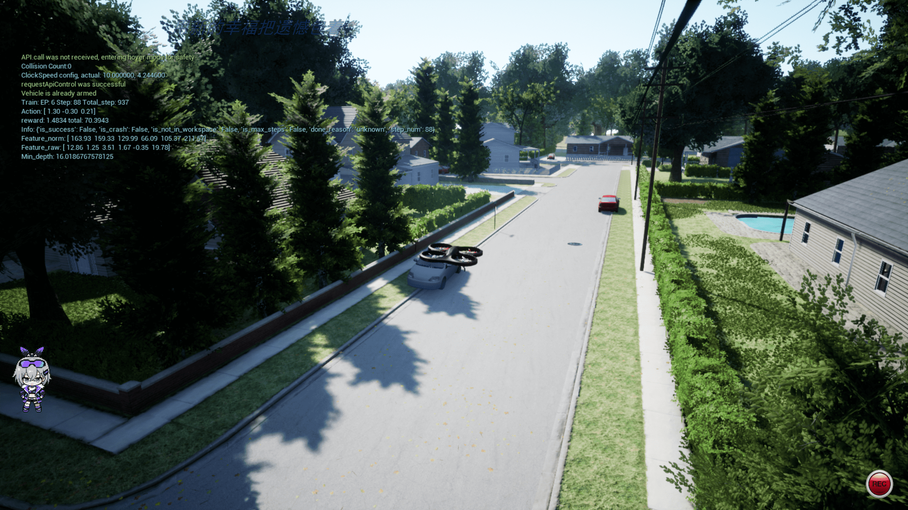
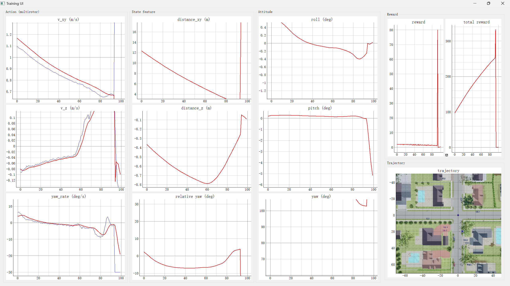
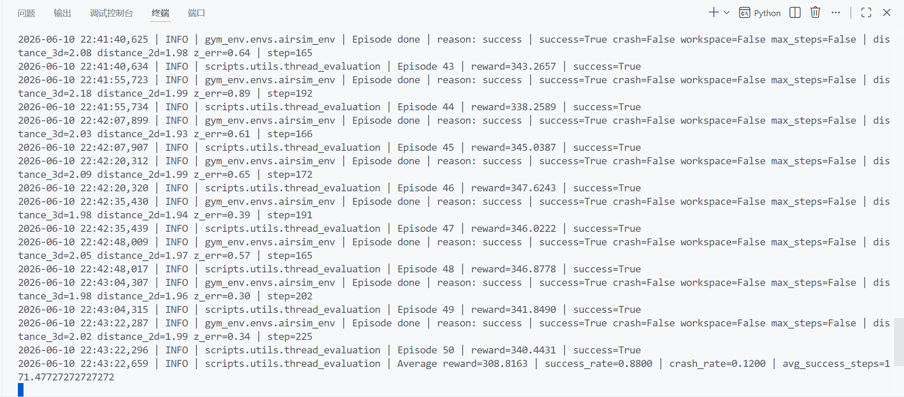

# drone_path_learning

基于 AirSim、Gym 和 Stable-Baselines3 的无人机视觉导航强化学习项目。项目把 AirSim 多旋翼无人机封装为标准 Gym 环境 `airsim-env-v0`，支持深度图、向量特征和 LGMD 仿生视觉等观测方式，并提供 PPO、SAC、TD3 训练与 PyQt5 可视化评估流程。

---

## 目录

- [项目简介](#项目简介)
- [核心特性](#核心特性)
- [运行效果展示](#运行效果展示)
- [项目结构](#项目结构)
- [技术架构](#技术架构)
- [环境准备](#环境准备)
- [快速开始](#快速开始)
- [训练流程](#训练流程)
- [评估流程](#评估流程)
- [配置文件说明](#配置文件说明)
- [观测空间与动作空间](#观测空间与动作空间)
- [奖励与终止条件](#奖励与终止条件)
- [训练产物](#训练产物)
- [测试工具](#测试工具)
- [常见问题](#常见问题)
- [扩展方向](#扩展方向)

---

## 项目简介

`drone_path_learning` 面向无人机自主路径学习与避障导航实验，核心目标是让多旋翼无人机在 AirSim 仿真环境中根据视觉和状态信息学习从起点飞向目标点的控制策略。

项目提供了完整的强化学习实验闭环：

1. 通过 AirSim 获取深度图、场景图、无人机位姿、速度和目标相对状态。
2. 将仿真交互封装为 Gym 风格的 `reset()`、`step(action)`、`observation_space` 和 `action_space`。
3. 使用 Stable-Baselines3 中的 PPO、SAC 或 TD3 训练策略。
4. 通过自定义 CNN/MLP 特征提取器处理深度图和状态特征。
5. 使用 PyQt5 界面实时展示动作、状态、姿态、奖励和轨迹。
6. 将模型、TensorBoard 日志、配置文件和评估结果统一保存到 `logs/`。

适合用于：

- 无人机视觉导航强化学习实验；
- AirSim 与 Gym 环境封装学习；
- PPO/SAC/TD3 在连续控制任务上的对比；
- 深度图、向量特征、LGMD 特征在避障导航中的效果比较；
- 课程式训练、模型续训和策略评估。

---

## 核心特性

- **AirSim 多旋翼仿真**：通过 `airsim.MultirotorClient` 控制无人机起飞、重置、移动、暂停仿真和读取传感器。
- **Gym 环境接口**：本地包 `gym_env` 注册 `airsim-env-v0`，可直接 `gym.make("airsim-env-v0")` 创建环境。
- **多算法支持**：训练线程支持 `PPO`、`SAC`、`TD3`。
- **多观测模式**：支持 `depth`、`vector`、`lgmd` 三类感知方式。
- **多策略网络**：支持 `mlp`、`CNN_FC`、`CNN_GAP`、`CNN_GAP_BN`、`CNN_MobileNet`、`No_CNN`。
- **3D/2D 控制切换**：通过 `navigation_3d` 控制动作维度，支持水平速度、垂直速度和偏航角速度控制。
- **课程式配置**：提供多个 `NH_center` 阶段配置，逐步调整目标距离、初始朝向和目标方向范围。
- **训练可视化**：PyQt5 UI 展示动作、状态、姿态、奖励曲线和飞行轨迹。
- **评估结果落盘**：保存轨迹、动作、状态、观测和汇总指标，便于后续分析。
- **WandB 可选集成**：配置 `use_wandb=True` 后可同步 TensorBoard 与训练代码。

---

## 运行效果展示

### 训练可视化界面



### 评估可视化界面



### 评估结果展示



---

## 项目结构

```text
src/drone_path_learning/
├── README.md
├── requirements.txt
├── main.py
├── configs/
│   ├── config_NH_center_Multirotor_3D.ini
│   ├── config_NH_center_Multirotor_Phase1_Fixed10m.ini
│   ├── config_NH_center_Multirotor_Phase2_Fixed20m.ini
│   ├── config_NH_center_Multirotor_Phase3A_Yaw90_20m.ini
│   ├── config_NH_center_Multirotor_Phase3B_Yaw90_Goal90_20m.ini
│   ├── config_NH_center_Multirotor_Phase3C_Yaw90_Goal180_20m.ini
│   └── config_NH_center_Multirotor_Phase3D_Yaw180_Goal180_20m.ini
├── gym_env/
│   ├── setup.py
│   └── gym_env/
│       ├── __init__.py
│       └── envs/
│           ├── airsim_env.py
│           └── dynamics/
│               └── multirotor_airsim.py
├── resources/
│   └── env_maps/
│       └── NH_center.png
├── scripts/
│   ├── train.py
│   ├── evaluation.py
│   ├── start_train_with_plot.py
│   ├── start_evaluate_with_plot.py
│   └── utils/
│       ├── custom_policy_sb3.py
│       ├── thread_train.py
│       ├── thread_evaluation.py
│       └── ui_train.py
└── tools/
    ├── map_generation/
    │   └── map_generation.py
    └── test/
        ├── env_test.py
        └── torch_gpu_cpu_test.py
```

关键文件说明：

| 文件 | 作用 |
|---|---|
| [main.py](../../src/drone_path_learning/main.py) | 统一启动入口，支持训练、评估、Torch/CUDA 检查和环境测试 |
| [gym_env/gym_env/__init__.py](../../src/drone_path_learning/gym_env/gym_env/__init__.py) | 注册 Gym 环境 `airsim-env-v0` |
| [gym_env/gym_env/envs/airsim_env.py](../../src/drone_path_learning/gym_env/gym_env/envs/airsim_env.py) | AirSim Gym 环境主体，定义观测、奖励、终止条件和 PyQt 信号 |
| [gym_env/gym_env/envs/dynamics/multirotor_airsim.py](../../src/drone_path_learning/gym_env/gym_env/envs/dynamics/multirotor_airsim.py) | 多旋翼动力学与 AirSim 控制接口 |
| [scripts/utils/thread_train.py](../../src/drone_path_learning/scripts/utils/thread_train.py) | 配置化训练线程，创建 SB3 模型并保存日志和模型 |
| [scripts/utils/thread_evaluation.py](../../src/drone_path_learning/scripts/utils/thread_evaluation.py) | 评估线程，加载模型并保存评估轨迹与指标 |
| [scripts/utils/custom_policy_sb3.py](../../src/drone_path_learning/scripts/utils/custom_policy_sb3.py) | 自定义 CNN/MLP 特征提取器 |
| [scripts/utils/ui_train.py](../../src/drone_path_learning/scripts/utils/ui_train.py) | PyQt5 可视化界面 |

---

## 技术架构

项目整体可以分为五层：

| 层级 | 核心功能 | 对应代码 |
|---|---|---|
| 仿真层 | AirSim 场景、无人机、深度相机、碰撞信息和仿真暂停/恢复 | [multirotor_airsim.py](../../src/drone_path_learning/gym_env/gym_env/envs/dynamics/multirotor_airsim.py) |
| 环境层 | Gym 接口、观测构造、奖励计算、终止判断、工作空间约束 | [airsim_env.py](../../src/drone_path_learning/gym_env/gym_env/envs/airsim_env.py) |
| 算法层 | PPO/SAC/TD3 初始化、超参数读取、模型训练、断点续训 | [thread_train.py](../../src/drone_path_learning/scripts/utils/thread_train.py) |
| 网络层 | CNN、MobileNet、No-CNN 和 MLP 特征提取 | [custom_policy_sb3.py](../../src/drone_path_learning/scripts/utils/custom_policy_sb3.py) |
| 展示与分析层 | PyQt5 训练 UI、评估 UI、TensorBoard、WandB、`.npy` 结果保存 | [ui_train.py](../../src/drone_path_learning/scripts/utils/ui_train.py)、[thread_evaluation.py](../../src/drone_path_learning/scripts/utils/thread_evaluation.py) |

训练交互流程：

```text
AirSim 场景
  ↓ 深度图 / 状态 / 碰撞信息
AirsimGymEnv.get_obs()
  ↓ depth / vector / lgmd 观测
Stable-Baselines3 策略网络
  ↓ action: 速度与偏航控制
MultirotorDynamicsAirsim.set_action()
  ↓ moveByVelocityAsync / moveByVelocityZAsync
AirSim 执行动作并返回新状态
  ↓
奖励计算、终止判断、日志和 UI 更新
```

---

## 环境准备

### 1. 前置条件

- Windows 或 Linux；
- Python 环境；
- AirSim 可运行，并已准备包含多旋翼无人机的仿真场景；
- 支持 CUDA 的 NVIDIA GPU 可显著提升训练速度，但不是必需；
- 如果使用可视化界面，需要本机图形界面支持 PyQt5 窗口显示。

项目依赖文件位于：

[requirements.txt](../../src/drone_path_learning/requirements.txt)

主要依赖包括：

- `airsim==1.6.0`
- `gym==0.17.3`
- `stable-baselines3`
- `torch==2.0.0+cu118`
- `torchvision==0.15.0+cu118`
- `opencv-contrib-python`
- `pyqt5`
- `pyqtgraph`
- `wandb`
- `tensorboard`

### 2. 安装 Python 依赖

```bash
cd src/drone_path_learning
pip install -r requirements.txt
```

### 3. 安装本地 Gym 环境包

```bash
cd src/drone_path_learning
pip install -e gym_env
```

安装后，`gym_env` 会注册：

```python
gym.make("airsim-env-v0")
```

### 4. 启动 AirSim

运行训练或测试前，需要先启动 AirSim 仿真器，并确保：

- AirSim 可以正常连接；
- 多旋翼无人机可用；
- 相机名称为代码中使用的 `"0"`；
- 深度图接口 `airsim.ImageType.DepthVis` 可以返回有效图像；
- 当前场景与配置中的 `env_name` 相匹配，例如 `NH_center`。

---

## 快速开始

### 方式一：使用统一入口

```bash
cd src/drone_path_learning
python main.py
```

不传参数时，程序会显示交互菜单：

| 编号 | 模式 | 说明 |
|---:|---|---|
| 1 | `train` | 启动带 PyQt5 UI 的训练 |
| 2 | `eval` | 启动带 PyQt5 UI 的评估 |
| 3 | `torch_check` | 检查 PyTorch / CUDA |
| 4 | `env_test` | 执行 AirSim 环境快速步进测试 |

也可以直接指定模式：

```bash
python main.py train -- --config configs/config_NH_center_Multirotor_3D.ini
python main.py env_test -- --config configs/config_NH_center_Multirotor_3D.ini
python main.py torch_check
```

说明：`main.py` 会把 `--` 后面的参数透传给目标脚本。

### 方式二：直接启动训练可视化

```bash
cd src/drone_path_learning
python scripts/start_train_with_plot.py --config configs/config_NH_center_Multirotor_3D.ini
```

如果不指定 `--config`，默认使用：

```text
configs/config_NH_center_Multirotor_Phase3D_Yaw180_Goal180_20m.ini
```

### 方式三：直接启动命令行训练

```bash
cd src/drone_path_learning
python scripts/utils/thread_train.py --config config_NH_center_Multirotor_3D
```

`--config` 既可以传 `configs/` 下不带 `.ini` 后缀的配置名，也可以传显式 `.ini` 路径。

---

## 训练流程

训练入口推荐使用：

[scripts/start_train_with_plot.py](../../src/drone_path_learning/scripts/start_train_with_plot.py)

内部核心训练逻辑位于：

[scripts/utils/thread_train.py](../../src/drone_path_learning/scripts/utils/thread_train.py)

训练过程如下：

1. 读取 `.ini` 配置文件。
2. 创建 `gym.make("airsim-env-v0")` 环境。
3. 调用 `env.set_config(cfg)` 设置场景、动力学、观测方式、奖励方式和动作空间。
4. 根据 `policy_name` 选择 `MlpPolicy` 或 `CnnPolicy`。
5. 根据 `algo` 创建 PPO、SAC 或 TD3 模型。
6. 如果配置了 `resume_model_path`，加载已有模型继续训练。
7. 创建日志目录、模型目录、配置备份目录和数据目录。
8. 使用 `CheckpointCallback` 定期保存 checkpoint。
9. 训练结束后保存最终模型 `model_sb3.zip`。

常用训练命令：

```bash
python scripts/start_train_with_plot.py --config configs/config_NH_center_Multirotor_3D.ini
python scripts/start_train_with_plot.py --config configs/config_NH_center_Multirotor_Phase1_Fixed10m.ini
python scripts/start_train_with_plot.py --config configs/config_NH_center_Multirotor_Phase3D_Yaw180_Goal180_20m.ini
```

当前提供的课程式配置：

| 配置文件 | 训练意图 |
|---|---|
| `config_NH_center_Multirotor_3D.ini` | 基础 3D 导航配置，使用深度图和 CNN |
| `config_NH_center_Multirotor_Phase1_Fixed10m.ini` | 固定 10m 目标距离，适合初期收敛 |
| `config_NH_center_Multirotor_Phase2_Fixed20m.ini` | 固定 20m 目标距离，提高任务距离 |
| `config_NH_center_Multirotor_Phase3A_Yaw90_20m.ini` | 扩展初始偏航角范围 |
| `config_NH_center_Multirotor_Phase3B_Yaw90_Goal90_20m.ini` | 同时扩展初始朝向与目标方向 |
| `config_NH_center_Multirotor_Phase3C_Yaw90_Goal180_20m.ini` | 继续扩大目标方向范围 |
| `config_NH_center_Multirotor_Phase3D_Yaw180_Goal180_20m.ini` | 更完整的随机朝向/目标方向训练配置 |

---

## 评估流程

评估入口推荐使用：

[scripts/start_evaluate_with_plot.py](../../src/drone_path_learning/scripts/start_evaluate_with_plot.py)

示例：

```bash
cd src/drone_path_learning
python scripts/start_evaluate_with_plot.py --eval-path logs/NH_center/<your_run_dir> --eval-eps 50
```

可选参数：

| 参数 | 默认值 | 说明 |
|---|---|---|
| `--eval-path` | 示例训练目录 | 训练产物目录，内部应包含 `config/` 和 `models/` |
| `--config` | `<eval-path>/config/config.ini` | 指定评估配置 |
| `--model-file` | `<eval-path>/models/model_sb3.zip` | 指定模型文件 |
| `--eval-eps` | `50` | 评估回合数 |
| `--eval-env` | 不覆盖 | 覆盖配置中的 `env_name` |
| `--eval-dynamics` | 不覆盖 | 覆盖配置中的 `dynamic_name` |

命令行评估：

```bash
python scripts/evaluation.py --mode single --eval-path logs/NH_center/<your_run_dir> --eval-eps 50
```

批量评估：

```bash
python scripts/evaluation.py --mode multi --eval-logs-path logs/NH_center --eval-logs-name NH_center --eval-env NH_center --eval-dynamics Multirotor
```

评估会保存：

```text
<eval-path>/eval_<eval_eps>_<env_name>_<dynamic_name>/
├── traj_eval.npy
├── action_eval.npy
├── state_eval.npy
├── obs_eval.npy
└── results.npy
```

`results.npy` 包含：

```text
[平均奖励, 成功率, 碰撞率, 成功回合平均步数]
```

---

## 配置文件说明

配置文件采用 `.ini` 格式，核心分区包括：

### `[options]`

| 参数 | 示例 | 说明 |
|---|---|---|
| `env_name` | `NH_center` | 环境名称，目前代码支持 `NH_center`、`NH_tree`、`City`、`City_400`、`Tree_200`、`SimpleAvoid`、`Forest`、`Trees` |
| `dynamic_name` | `Multirotor` | 动力学类型，清理后的代码仅支持 `Multirotor` |
| `navigation_3d` | `True` | 是否启用 3D 动作空间 |
| `using_velocity_state` | `True` | 状态特征中是否包含速度信息 |
| `perception` | `depth` / `vector` / `lgmd` | 观测模式 |
| `algo` | `PPO` / `SAC` / `TD3` | 强化学习算法 |
| `policy_name` | `CNN_FC` / `mlp` | 策略网络类型 |
| `net_arch` | `[256, 128]` | Actor/Critic 或 MLP 网络结构 |
| `activation_function` | `relu` / `tanh` | 激活函数 |
| `cnn_feature_num` | `64` | CNN 或视觉分支输出特征数 |
| `keyboard_debug` | `False` | 是否开启键盘步进调试 |
| `generate_q_map` | `False` | 是否生成 Q 值地图，主要用于 TD3/SAC |
| `use_wandb` | `False` | 是否启用 WandB |
| `total_timesteps` | `250000` | 训练总步数 |
| `resume_model_path` | 空或模型路径 | 续训模型路径 |
| `reset_num_timesteps` | `True` | 续训时是否重置 SB3 时间步 |
| `checkpoint_freq` | `10000` | checkpoint 保存间隔 |

### `[environment]`

| 参数 | 示例 | 说明 |
|---|---|---|
| `max_depth_meters` | `15` | 深度图裁剪最大距离 |
| `screen_height` / `screen_width` | `48` / `64` | 输入图像尺寸 |
| `reward_type` | `reward_distance_based` | 奖励函数类型 |
| `crash_distance` | `1.0` | 深度碰撞阈值 |
| `depth_collision_percentile` | `5` | 使用深度图低分位估计障碍距离 |
| `depth_collision_roi_top_ratio` | `0.65` | 碰撞检测使用的图像上部 ROI 比例 |
| `accept_radius` | `4` | 到达目标判定半径 |
| `success_check_mode` | `planar_with_altitude` | 成功判定模式 |
| `success_altitude_tolerance` | `8.0` | 高度误差容忍度 |
| `max_episode_steps` | `900` | 单回合最大步数 |
| `start_position` | `[0, 0, 5]` | 可选，覆盖默认起点 |
| `start_random_angle` | `3.14159265359` | 可选，起始偏航随机范围 |
| `goal_distance` | `20` | 可选，目标距离 |
| `goal_random_angle` | `3.14159265359` | 可选，目标方向随机范围 |

### `[DRL]`

| 参数 | 说明 |
|---|---|
| `gamma` | 折扣因子 |
| `learning_rate` | 学习率 |
| `n_steps` | PPO 每轮 rollout 步数 |
| `batch_size` | batch 大小 |
| `n_epochs` | PPO 每轮更新 epoch 数 |
| `gae_lambda` | GAE 参数 |
| `ent_coef` | 熵奖励系数 |
| `vf_coef` | Value loss 系数 |
| `clip_range` | PPO clip 范围 |
| `target_kl` | PPO KL 早停阈值 |
| `max_grad_norm` | 梯度裁剪 |
| `buffer_size` | SAC/TD3 回放缓冲区大小，相关配置中使用 |
| `learning_starts` | SAC/TD3 开始训练前的随机探索步数 |
| `train_freq` | SAC/TD3 训练频率 |
| `gradient_steps` | SAC/TD3 每次训练的梯度步数 |
| `action_noise_sigma` | SAC/TD3 动作噪声强度 |

### `[multirotor]`

| 参数 | 示例 | 说明 |
|---|---|---|
| `dt` | `0.1` | 控制步长 |
| `acc_xy_max` | `2.0` | 水平速度变化限制 |
| `v_xy_max` | `5` | 最大水平速度 |
| `v_xy_min` | `0.5` | 最小水平速度 |
| `v_z_max` | `2.0` | 最大垂直速度 |
| `yaw_rate_max_deg` | `30.0` | 最大偏航角速度 |
| `action_smoothing_alpha` | `0.25` | 动作平滑系数 |
| `yaw_rate_change_max_deg` | `5.0` | 单步偏航角速度变化限制 |

---

## 观测空间与动作空间

### 观测空间

环境根据 `perception` 返回不同观测：

| `perception` | 观测形状 | 说明 |
|---|---|---|
| `depth` | `(screen_height, screen_width, 2)` | 两通道图像：深度图通道 + 状态特征嵌入通道 |
| `vector` | `(1, cnn_feature_num + state_feature_length)` | 深度图分块特征 + 状态特征 |
| `lgmd` | `(1, cnn_feature_num + state_feature_length)` | LGMD 输出分块特征 + 状态特征 |

`depth` 模式处理逻辑：

1. 读取 AirSim 深度图。
2. resize 到配置中的 `screen_width x screen_height`。
3. 将深度限制在 `max_depth_meters` 内。
4. 归一化并反转，使近处障碍更醒目。
5. 将状态特征写入第二通道左上角。

`vector` 模式处理逻辑：

1. 读取深度图。
2. 将图像划分为 5 个水平区域。
3. 每个区域取最大激活值，形成 5 维视觉特征。
4. 拼接无人机状态特征。

状态特征由 `MultirotorDynamicsAirsim._get_state_feature()` 生成，通常包含：

- 到目标点的水平距离；
- 当前高度相对目标高度的误差；
- 指向目标的相对偏航角；
- 水平速度；
- 垂直速度；
- 偏航角速度。

如果 `navigation_3d=False` 或 `using_velocity_state=False`，状态特征维度会相应减少。

### 动作空间

动作空间由 [multirotor_airsim.py](../../src/drone_path_learning/gym_env/gym_env/envs/dynamics/multirotor_airsim.py) 定义。

3D 导航时：

| 动作索引 | 含义 | 范围 |
|---:|---|---|
| 0 | 水平速度 `v_xy` | `[v_xy_min, v_xy_max]` |
| 1 | 垂直速度 `v_z` | `[-v_z_max, v_z_max]` |
| 2 | 偏航角速度 `yaw_rate` | `[-yaw_rate_max_rad, yaw_rate_max_rad]` |

2D 导航时：

| 动作索引 | 含义 | 范围 |
|---:|---|---|
| 0 | 水平速度 `v_xy` | `[v_xy_min, v_xy_max]` |
| 1 | 偏航角速度 `yaw_rate` | `[-yaw_rate_max_rad, yaw_rate_max_rad]` |

动作在执行前会经过：

- 范围裁剪；
- 指数平滑；
- 水平加速度限制；
- 偏航角速度变化率限制；
- AirSim `moveByVelocityAsync` 或 `moveByVelocityZAsync` 控制。

---

## 奖励与终止条件

默认推荐奖励类型为：

```ini
reward_type = reward_distance_based
```

默认奖励函数 `compute_reward()` 综合考虑：

- 向目标点靠近的距离增量奖励；
- 朝向目标方向的额外奖励；
- 偏航角速度惩罚；
- 垂直速度和高度误差惩罚；
- 相对目标方向偏差惩罚；
- 障碍物距离过近惩罚；
- 成功到达奖励；
- 碰撞、飞出工作空间、超时惩罚。

其他奖励函数：

| 奖励类型 | 对应方法 | 说明 |
|---|---|---|
| `reward_distance_based` / `reward_default` | `compute_reward` | 当前默认距离进展奖励 |
| `reward_with_action` | `compute_reward_with_action` | 更强调动作代价 |
| `reward_new` | `compute_reward_multirotor_new` | 旧版多旋翼奖励 |
| `reward_lqr` | `compute_reward_lqr` | LQR 风格状态/动作二次惩罚 |
| `reward_final` | `compute_reward_final` | 综合距离、姿态、障碍和动作代价 |

回合终止条件：

| 条件 | 说明 | `info` 字段 |
|---|---|---|
| 到达目标 | 满足 `accept_radius` 和高度容忍度 | `is_success=True` |
| 碰撞 | AirSim 物理碰撞或深度估计障碍距离小于 `crash_distance` | `is_crash=True` |
| 飞出工作空间 | 超出当前环境设定的 x/y/z 范围 | `is_not_in_workspace=True` |
| 超过最大步数 | `step_num >= max_episode_steps` | `is_max_steps=True` |

`info["done_reason"]` 会返回：

```text
success / collision / out_of_workspace / max_steps
```

---

## 训练产物

每次训练默认输出到：

```text
src/drone_path_learning/logs/<env_name>/<timestamp>_<dynamic_name>_<policy_name>_<algo>/
```

目录示例：

```text
logs/NH_center/2026_05_31_18_25_Multirotor_mlp_PPO/
├── tb_logs/
├── models/
│   ├── model_sb3.zip
│   ├── model_sb3_ckpt_10000_steps.zip
│   └── ...
├── config/
│   └── config.ini
└── data/
```

各目录含义：

| 目录 | 说明 |
|---|---|
| `tb_logs/` | TensorBoard 日志 |
| `models/` | 最终模型和 checkpoint |
| `config/` | 本次训练使用的配置备份 |
| `data/` | Q 值地图等额外数据 |

查看 TensorBoard：

```bash
cd src/drone_path_learning
tensorboard --logdir logs
```

---

## 测试工具

### PyTorch / CUDA 检查

```bash
cd src/drone_path_learning
python tools/test/torch_gpu_cpu_test.py
```

该脚本会输出：

- PyTorch 版本；
- PyTorch 编译使用的 CUDA 版本；
- 当前 CUDA 是否可用；
- GPU 名称；
- cuDNN 是否可用。

### AirSim 环境快速测试

```bash
cd src/drone_path_learning
python tools/test/env_test.py --config configs/config_NH_center_Multirotor_3D.ini
```

该脚本会：

1. 创建 `airsim-env-v0`；
2. 加载配置；
3. 重置 AirSim 环境；
4. 使用固定动作执行 50 步；
5. 输出平均 FPS；
6. 结束时调用 `env.close()` 释放 AirSim 控制。

---

## 常见问题

### 1. `gym.make("airsim-env-v0")` 找不到环境

可能原因：本地 `gym_env` 没有安装。

解决方法：

```bash
cd src/drone_path_learning
pip install -e gym_env
```

### 2. AirSim 连接失败

可能原因：

- AirSim 仿真器没有启动；
- AirSim RPC 端口不可用；
- 当前环境不是多旋翼配置；
- Python 环境中的 `airsim` 包版本不兼容。

处理建议：

- 先手动打开 AirSim 场景；
- 确认无人机可以正常起飞；
- 再运行 `tools/test/env_test.py`。

### 3. 深度图读取失败或一直重试

代码会在 `responses[0].width == 0` 时持续重试。常见原因是相机名称或 AirSim settings 不匹配。

检查点：

- 相机名称是否为 `"0"`；
- AirSim 是否启用深度相机；
- 场景是否已完全加载；
- 仿真窗口是否处于可交互状态。

### 4. 训练 UI 无法打开

可能原因：

- 当前运行环境没有图形界面；
- PyQt5 安装失败；
- 远程服务器未配置 X11/桌面转发。

可先使用命令行训练入口：

```bash
python scripts/utils/thread_train.py --config config_NH_center_Multirotor_3D
```

### 5. GPU 不可用

先运行：

```bash
python tools/test/torch_gpu_cpu_test.py
```

如果 CUDA 不可用，训练会退回 CPU，速度会明显变慢。检查 NVIDIA 驱动、CUDA 运行时和 PyTorch CUDA 版本是否匹配。

### 6. 模型评估时找不到配置或模型

评估默认查找：

```text
<eval-path>/config/config.ini
<eval-path>/models/model_sb3.zip
```

如果文件名不同，显式指定：

```bash
python scripts/start_evaluate_with_plot.py ^
  --eval-path logs/NH_center/<your_run_dir> ^
  --config logs/NH_center/<your_run_dir>/config/config.ini ^
  --model-file logs/NH_center/<your_run_dir>/models/model_sb3.zip
```

### 7. 续训没有生效

检查配置：

```ini
resume_model_path = logs\NH_center\<run>\models\model_sb3.zip
reset_num_timesteps = False
```

如果 `resume_model_path` 为空，训练会从头初始化模型。

---

## 扩展方向

1. **更多 AirSim 场景**
   - 增加城市、森林、室内、窄通道等任务；
   - 为不同场景补充地图截图和起终点示意图；
   - 将 `resources/env_maps/` 中的地图与评估轨迹自动叠加。

2. **更完整的课程学习**
   - 按目标距离、随机朝向、障碍密度、高度变化逐级训练；
   - 自动从上一阶段最优模型续训下一阶段；
   - 记录每阶段成功率、碰撞率和平均步数。

3. **更多感知模型**
   - 对比深度图 CNN、向量特征、LGMD、光流、语义分割特征；
   - 引入轻量化视觉 backbone；
   - 加入注意力机制分析避障决策区域。

4. **强化学习算法对比**
   - 系统比较 PPO、SAC、TD3 的收敛速度、稳定性和安全性；
   - 增加 HER、BC、离线 RL 或模仿学习；
   - 添加安全约束或代价函数用于 Safe RL。

5. **评估与可视化增强**
   - 自动生成成功/失败轨迹图；
   - 绘制深度最小距离、偏航误差、动作平滑度曲线；
   - 将评估结果导出为表格和报告。

---

## 参考入口

- 项目源码: [src/drone_path_learning](https://github.com/OpenHUTB/nn/tree/main/src/drone_path_learning)
- 参考仓库: [DRL-DroneNavigation](https://github.com/eRGiBi/DRL-DroneNavigation)
