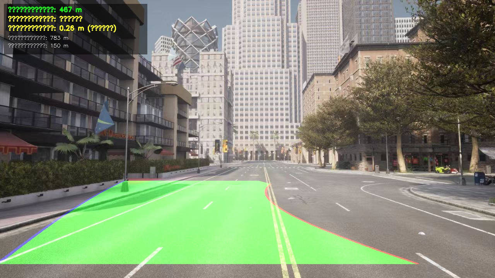

# 车道线检测（lane_detection）

基于 OpenCV 的 Carla 场景车道线检测模块，分步完成预处理、边缘检测、霍夫直线检测与 HSV 多车道拟合。

**作者**：ultra223  
**课题进度**：5/10（步骤1 基础检测 + 步骤2 HSV 优化 + 步骤3 透视变换+多项式拟合 + 步骤4 视频处理 + 步骤5 曲率与偏移计算）
**课题进度**：4/10（步骤1 基础检测 + 步骤2 HSV 优化 + 步骤3 透视变换+多项式拟合 + 步骤4 视频处理）
**课题进度**：3/10（步骤1 基础检测 + 步骤2 HSV 优化 + 步骤3 透视变换+多项式拟合）
**课题进度**：2/10（步骤1 基础检测 + 步骤2 HSV 优化）

## 模块结构

| 文件 | 说明 |
| :--- | :--- |
| `main.py` | **唯一入口**，运行整个模块 |
| `config.py` | 路径与算法参数 |
| `lane_preprocess.py` | 步骤1：灰度、Canny、ROI、霍夫 |
| `lane_detect.py` | 步骤2：HSV 黄白线、双黄线中心轴、左右车道 |
| `lane_advanced.py` | 步骤3 & 5：透视变换、滑动窗口、多项式拟合、曲率与偏移计算 |
| `lane_advanced.py` | 步骤3：透视变换、滑动窗口、二次多项式拟合 |
| `lane_video.py` | 步骤4：视频处理、帧间 EMA 平滑 |
| `carla_test.jpg` | 少量示例输入（运行依赖） |

## 开发环境

- Python 3.8+
- OpenCV-Python、NumPy

```bash
pip install opencv-python numpy -i https://pypi.tuna.tsinghua.edu.cn/simple
```

## 运行方式

在仓库根目录或模块目录下执行：

```bash
cd src/lane_detection
python main.py
```

```bash
# 步骤2：HSV 多车道检测
python main.py --mode hsv

# 步骤3：透视变换 + 滑动窗口 + 多项式拟合
python main.py --mode advanced

# 步骤4：视频模式（逐帧检测 + EMA 平滑）
python main.py --mode video --video path/to/video.mp4

# 重新生成文档配图（写入 docs/lane_detection/images）
python main.py --save-docs --no-show
python main.py --mode hsv --save-docs --no-show
python main.py --mode advanced --save-docs --no-show
# 重新生成文档配图（写入 docs/lane_detection/images）
python main.py --save-docs --no-show
python main.py --mode hsv --save-docs --no-show
python main.py --mode advanced --save-docs --no-show
```

## 步骤1：基础版（Canny + 霍夫）

对 Carla 测试图做灰度化、高斯模糊、Canny 边缘检测、梯形 ROI 裁剪，再用霍夫变换检测车道线段。

**输入原图**


**Canny 边缘**


**ROI 区域**


**霍夫直线叠加结果**


## 步骤2：HSV 预处理优化

在 HSV 空间分别提取黄色（双黄线）与白色（车道线）掩膜，以双黄线为界划分左右车道并拟合绘制。

**输入原图**


**黄色车道线掩膜**


**白色车道线掩膜**


**多车道拟合结果**


## 步骤3：透视变换 + 滑动窗口 + 多项式拟合

在 HSV + Sobel 梯度联合二值化的基础上，通过透视变换获取鸟瞰图，利用直方图定位车道线基点，滑动窗口搜索车道像素，最后使用二次多项式拟合弯道曲线并反透视叠加回原图。

**HSV + Sobel 二值化车道线**


**鸟瞰图透视变换**


**滑动窗口搜索**


**二次多项式拟合结果**


**最终检测结果**



## 步骤4：视频处理与帧间平滑

在步骤3的基础上，支持视频文件输入，逐帧执行高级车道线检测流水线，并对连续帧的多项式拟合系数做指数移动平均（EMA）平滑，消除相邻帧之间的抖动，输出稳定的车道线跟踪结果。

**关键参数**

| 参数 | 默认值 | 说明 |
| :--- | :--- | :--- |
| `--alpha` | 0.3 | EMA 平滑系数（0~1），越小越平滑 |
| `--video` | — | 输入视频路径 |
| `--save-docs` | — | 保存输出视频到文档目录 |

**EMA 平滑公式**

```
fit_smoothed = α × fit_current + (1 − α) × fit_previous
```

- α = 1.0：完全使用当前帧结果（无平滑，可能抖动）
- α = 0.1：高度平滑，响应慢但稳定
- α = 0.3（默认）：兼顾响应速度和平滑度

## 步骤5：车道曲率与车辆偏移计算

在步骤3/4的基础上，利用二次多项式拟合系数计算车道曲率半径与车辆相对车道中心的横向偏移，并在结果图上叠加实时信息，帮助评估驾驶状态。

**关键参数**

| 参数 | 默认值 | 说明 |
| :--- | :--- | :--- |
| `--no-metrics` | 否 | 隐藏曲率与偏移信息 |
| `ym_per_pix` | 30/720 | 纵向像素→米转换因子 |
| `xm_per_pix` | 3.7/700 | 横向像素→米转换因子 |

**曲率半径公式**

```
车道线模型: x = A·y² + B·y + C
曲率半径:   R = (1 + (2Ay + B)²)^(3/2) / |2A|
```

- 像素坐标系数先转换为真实世界（米）坐标再计算
- 曲率半径 > 800 m 视为直道
- 颜色编码：绿色=安全，黄色=弯道，红色=偏移过大

**叠加信息**

| 信息 | 说明 |
| :--- | :--- |
| 曲率半径 | 左右车道线平均曲率半径（米） |
| 车道方向 | 直行 / 左弯 / 右弯 |
| 车辆偏移 | 车辆相对车道中心的横向偏移（米） |
| 偏移方向 | 居中 / 偏左 / 偏右 |
| 左右线曲率 | 各车道线独立的曲率半径 |

**使用方式**

```bash
# 图片模式（自动显示曲率与偏移）
python main.py --mode advanced

# 视频模式（每帧显示曲率与偏移）
python main.py --mode video --video path/to/video.mp4

# 隐藏曲率信息
python main.py --mode advanced --no-metrics
python main.py --mode video --video path/to/video.mp4 --no-metrics
```

## 参考

- [OpenHUTB/nn 贡献指南](https://github.com/OpenHUTB/nn/blob/main/README.md)
- [carla_CAM 模块文档](../carla_CAM/README.md)（文档与 mkdocs 约定示例）