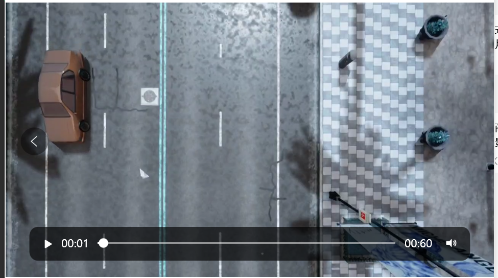
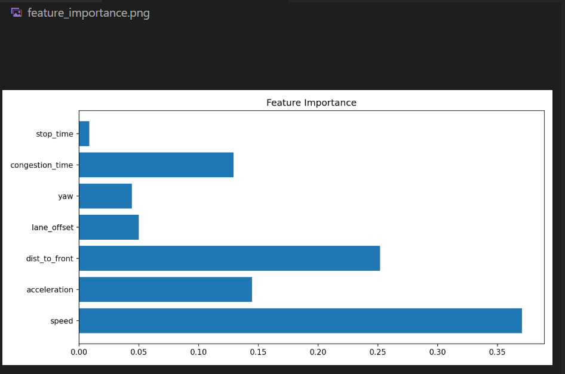
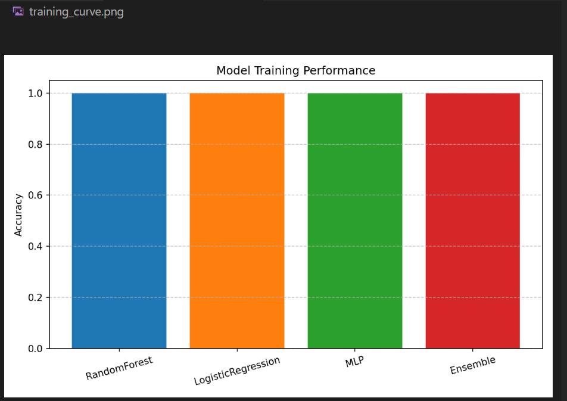
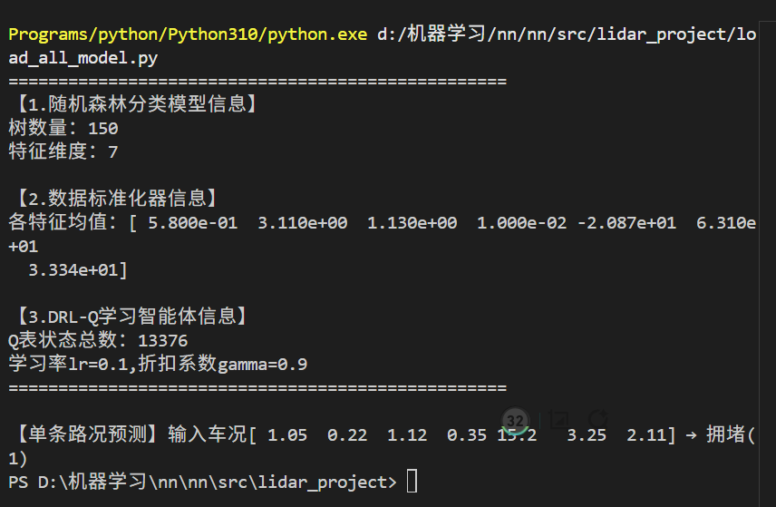
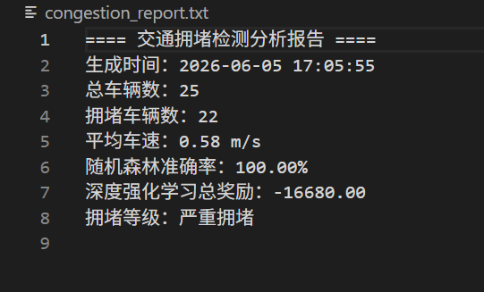
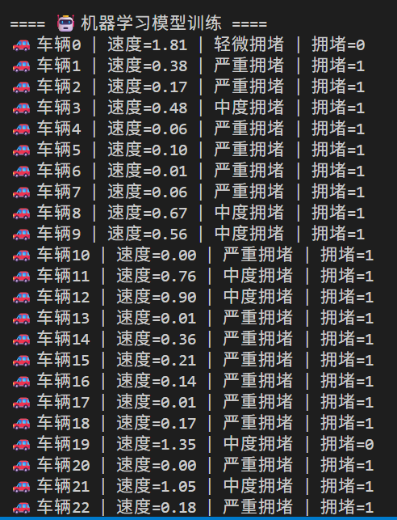
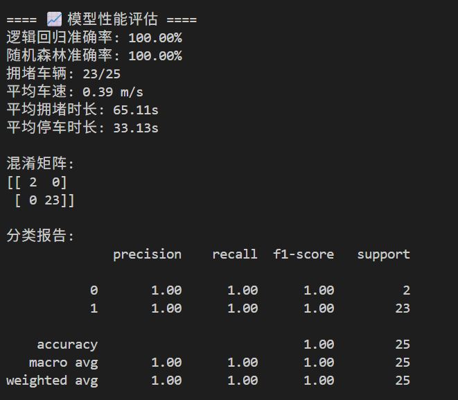

# carla_traffic_control

用于在 Carla 模拟器中实现基于强化学习与多模型融合的交通拥堵仿真与智能调控系统。
该项目旨在提升自动驾驶背景下交通流管理的效率与模型决策透明度。

---

## 1. 强化学习核心原理与数学表达
在我们的项目中使用了 Q-Learning 强化学习算法来控制车辆行驶速度，以缓解交通拥堵。为了理解智能体是如何做出限速决策的，我们以核心更新公式为例进行说明：

### 1.1 核心数学公式
Q-Learning 的目的是让智能体通过不断与交通环境交互，学习到最优的“状态-动作”价值函数，从而做出缓解拥堵的最优限速决策。

**步骤1：定义状态、动作与奖励**

智能体的状态由车辆的瞬时速度、加速度和与前车的距离共同决定：
$$s = (\text{round}(speed,1),\ \text{round}(acc,1),\ \text{round}(distance,1))$$

智能体的动作是三个不同的目标行驶速度：
- 动作 0：目标车速 $2.0\ \text{m/s}$
- 动作 1：目标车速 $5.0\ \text{m/s}$
- 动作 2：目标车速 $8.0\ \text{m/s}$

根据车辆的实时速度，我们定义了分段奖励函数：
$$
r =
\begin{cases}
5, & 0.5 < speed < 2.0 \\
-5, & speed < 0.2 \\
1, & \text{其他}
\end{cases}
$$

---

**步骤2：更新Q值（状态-动作价值函数）**

通过不断迭代，智能体更新其价值表，公式如下：
$$Q(s,a) = Q(s,a) + \alpha \cdot \left[ r + \gamma \cdot \max_{a'} Q(s',a') - Q(s,a) \right]$$

这一步更新后，智能体就能根据新的经验，修正它对“当前状态下采取某个动作能带来多少长期收益”的判断，从而在下一轮做出更优决策。

---

## 2. 拥堵识别多模型模块
为了判断交通是否拥堵，我们构建了一个多模型融合的分类系统。

### 2.1 输入特征定义
模型的输入是车辆的7维行驶特征向量：
$$X = \left[ speed,\ acceleration,\ dist\_to\_front,\ lane\_offset,\ yaw,\ congestion\_time,\ stop\_time \right]$$

### 2.2 模型组成与集成
我们训练了三个独立的分类模型，并通过投票机制融合它们的预测结果：
1.  **逻辑回归**：线性基线模型，用于对比
2.  **随机森林**：树集成模型，可输出特征重要性
3.  **MLP多层感知机**：深度学习模型，捕捉非线性关系
4.  **三模型投票集成**：对三个模型的预测结果取均值后四舍五入，得到最终的拥堵判断

---

## 3. 项目运行流程与输出文件
### 3.1 运行步骤
1.  启动 CARLA 0.9.15 仿真器
2.  安装项目依赖：
    ```bash
    pip install -r requirements.txt -i https://pypi.tuna.tsinghua.edu.cn/simple
### 3.2 运行效果截图

CARLA 仿真车流场景：



### 3.3 输出文件说明

运行结束后，会在项目目录自动生成以下文件：

- `congestion_data.csv`：车辆行驶特征数据集
- `congestion_rf_model.pkl` / `congestion_mlp_model.pkl`：训练好的分类模型
- `drl_agent.pkl`：训练完成的 Q-Learning 智能体
- `congestion_result.json`：仿真与模型综合统计结果
- `congestion_video.mp4`：车流仿真录制视频
- `feature_importance.png` / `training_curve.png`：可视化图表

---

## 4. 可视化结果展示

特征重要性可视化图表：

多模型准确率对比图表：

机器学习模型及分析报告输出结果:







