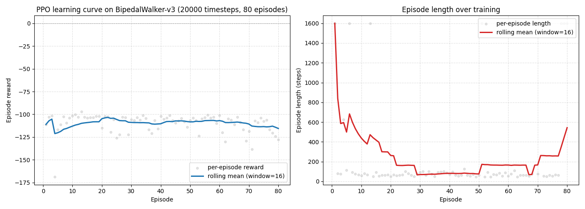

# Bipedal Walker PPO Training

This project focuses on training an agent using **Proximal Policy Optimization (PPO)** within the **Bipedal Walker** environment. The environment simulates a bipedal robot with 4 joints and 2 legs, challenging the agent to traverse rough terrain. Both normal and hardcore modes are implemented.

## Table of Contents
0. [About Bipedal Walker](#about-bipedal-walker)
1. [Project Structure](#project-structure)
2. [Training Process](#training-process)
    - Normal and Hardcore modes with PPO
3. [Environment Setup](#environment-setup)
    - 3.1 make_env()
    - 3.2 observe_model()
4. [Model Evaluation](#model-evaluation)
5. [Training Logs and Analysis](#training-logs-and-analysis)
6. [Improvements](#improvements)
7. [Installation Requirements](#installation-requirements)
8. [Credits](#credits)

## 0. About Bipedal Walker

The **Bipedal Walker** environment, based on the Box2D physics engine, simulates a bipedal robot navigating various terrains. The challenge for the agent is to maintain balance, coordination, and locomotion in the face of obstacles.

- **Observation Space**: 24 continuous values including hull angles, velocities, joint angles, and LIDAR readings.
- **Action Space**: 4 continuous values controlling the torque applied to the hip and knee joints.
- **Rewards**: Positive for forward movement, negative for excessive joint torque and falling.
- **Termination**: When the agent falls or exceeds the step limit (1600 steps for normal mode, 2000 for hardcore).

## 1. Project Structure

- **main.py**: Contains the training loop for both normal and hardcore modes.
- **env_utils.py**: A utility script that configures the Bipedal Walker environment with optional features such as frame stacking, video recording, and reward normalization.
- **logs/**: Directory for storing training logs.
- **models/**: Directory for saving trained PPO models.
- **videos/**: If enabled, recorded video episodes will be saved here.

## 2. Training Process

### Normal Mode
- **Timesteps**: 1 million
- **Environment**: Standard Bipedal Walker (`BipedalWalker-v3`)
- **Techniques**: Vectorized environments, reward normalization, frame stacking, video recording.
- **Model**: PPO with a Multi-Layer Perceptron (MLP) policy.

### Hardcore Mode
- **Timesteps**: 5 million
- **Environment**: Hardcore Bipedal Walker (`BipedalWalkerHardcore-v3`)
- **Techniques**: Same as normal mode with more challenging terrain and increased training duration.

The training uses Stable Baselines3's PPO algorithm and runs with vectorized environments for parallel training.

## 3. Environment Setup

The environment is set up using two key functions from the **env_utils.py** script:

### 3.1 make_env()

The `make_env()` function prepares the environment for training and evaluation with several configurable options:

- **Environment Creation**: By default, the environment created is `BipedalWalker-v3`. However, you can enable the hardcore mode by passing `hardcore=True` to switch to `BipedalWalkerHardcore-v3`.
  
- **Render Mode**: The environment can be rendered in different modes, such as 'human' for real-time visualization or 'rgb_array' for video recording.

- **Video Recording**: If `record_video=True` is set, the environment records every 1000 steps and saves the recordings in the specified folder.

- **Monitor**: The environment can be wrapped with a monitor to log performance metrics such as rewards and episode lengths. These logs are useful for analyzing the training process later.

- **Vectorized Operations**: To speed up training, `DummyVecEnv` is used to enable parallel processing of multiple environment instances.

- **Observation & Reward Normalization**: The environment is wrapped with `VecNormalize` to stabilize training by normalizing both observations and rewards. This helps the agent learn more effectively.

- **Frame Stacking**: The last `n` frames (by default, 4) can be stacked using `VecFrameStack`, providing the agent with temporal context, which is crucial for environments like Bipedal Walker that require an understanding of movement dynamics over time.

- **Clip Observations**: You can clip observations to avoid outliers during training by setting `clip_obs` to a certain value (default: 10.0).

### Example Usage:

```python
env = make_env(env_name="BipedalWalker-v3", hardcore=True, record_video=True, use_monitor=True)
```

### 3.2 observe_model()

The observe_model() function loads a trained PPO model and evaluates it in the specified environment. It automatically checks if VecNormalize and VecFrameStack were used during training and applies them accordingly.

- **Model Loading:** The trained model is loaded from the specified file path.

- **Environment Setup:** Depending on whether hardcore mode is enabled, the environment BipedalWalker-v3 or BipedalWalkerHardcore-v3 is selected.
- **VecNormalize & VecFrameStack:** If these wrappers were used during training, they are applied to the evaluation environment to ensure consistent behavior.
- **Evaluation:** The model is evaluated over a specified number of episodes, and the mean and standard deviation of the rewards are returned.

### Example Usage:
```python
mean_reward, std_reward = observe_model(model_path='models/ppo_bipedalwalker_1M', n_eval_episodes=5, hardcore=False)
```

This setup ensures that the environment is optimized for both training and evaluation, providing flexibility with advanced features like video recording, reward normalization, and frame stacking.
## 4. Model Evaluation

Model evaluation is performed across multiple episodes using the `observe_model()` function, which loads the trained model and runs it in human-render mode for visualization.

### Example Evaluation Output:

- **Normal Mode**: `Average reward: 248.39 ± 112.10`
- **Hardcore Mode (3M)**: `Average reward: -28.23 ± 24.82`
- **Hardcore Mode (5M)**: `Average reward: -10.66 ± 3.91`
- **Hardcore Mode (7M)**: `Average reward: -5.45 ± 2.10`

These results show that the agent performs relatively well in the normal environment but struggles in the hardcore version, where further training or parameter tuning may be needed.

## 5. Training Logs and Analysis

Training logs from the 5 million hardcore timesteps are analyzed for insights into agent performance:

- **Reward Trend**: The reward shows fluctuations but tends to stabilize over time.
- **Episode Length Trend**: The agent consistently learns to survive longer as training progresses, though there are occasional dips.
- **Correlation**: A strong positive correlation (0.89) between reward and episode length, indicating that the longer the agent survives, the more reward it earns.

Visualizations such as reward trends and episode length moving averages are generated using `pandas` and `matplotlib`.

## 6. Improvements

Recommendations for improving the agent's performance:
- **Adjust Learning Rate**: A smaller learning rate may lead to more stable improvements.
- **Reward Restructuring**: Incentivize the agent to prioritize survival and balance over forward movement.
- **Increased Exploration**: Methods such as ε-greedy or curiosity-driven exploration can help the agent learn more diverse strategies.
- **Extended Training**: Additional timesteps can provide the agent with more experience and lead to better policies.

## 6.5 学习曲线可视化（learning_curve.py）

模块新增 `learning_curve.py` 脚本，自动完成"短训 → 读日志 → 画曲线"全流程，无需任何先决条件即可一键运行：

```bash
python learning_curve.py                       # 默认 5000 timesteps
python learning_curve.py 20000                 # 指定 timesteps
python learning_curve.py 5000 demo.png         # 指定 timesteps + 输出文件
```

工作流程：
1. 调用 `env_utils.py` 的 Monitor wrapper 创建 `BipedalWalker-v3` 环境，自动写入 `logs/*.monitor.csv`
2. 用 PPO MlpPolicy 训练指定步数（CPU 上 20000 步约 50 秒）
3. 读取 Monitor 日志，控制台打印 markdown 训练摘要表（总 episode 数、平均/最高/末段奖励、平均轮长）
4. 用 matplotlib 绘制双栏 PNG：左图 = reward vs episode + 滚动均值；右图 = episode length vs episode + 滚动均值

下图为 20000 timesteps 训练 80 个 episode 后的输出（可见 episode length 从初始 1600 步逐步下降到 ~100 步，体现 agent 在学习避免无效探索）：



## 7. Installation Requirements

To install the necessary dependencies, use the provided `requirements.txt`:

```bash
pip install -r requirements.txt
```

Dependencies include:

	•	Python 3.8+
	•	gymnasium for the environment
	•	stable-baselines3 for the PPO implementation
	•	pandas and matplotlib for log analysis and visualizations

## 8. Credits

This project is based on the work of Oleg Klimov, adapted for PPO training using Stable Baselines3.
